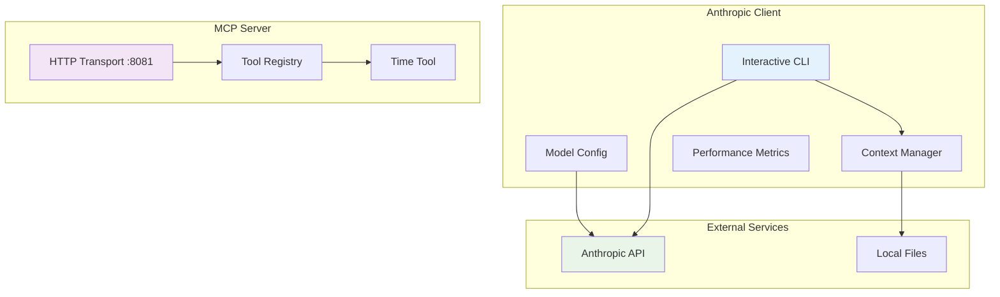

# AI Client with MCP Server Example

A comprehensive Go-based toolkit demonstrating AI API integration and Model Context Protocol (MCP) implementation. This project showcases two complementary components working together to provide a complete AI development experience.

## Project Components

### 🤖 AI Client (`/client`)
An advanced interactive CLI client for Anthropic's API featuring:
- **Model Configuration**: JSON-based model definitions with parameter control
- **Context Management**: Intelligent file loading with token counting and auto-trimming
- **Performance Monitoring**: Real-time metrics for tokens/sec, response time, and context usage
- **Interactive CLI**: Rich command interface with history, completion, and conversation management

### 🔧 MCP Server (`/server`)
A Model Context Protocol server providing extensible tool capabilities:
- **HTTP-based MCP Implementation**: RESTful server compliant with MCP specification
- **Tool System**: Extensible architecture for adding custom tools and capabilities
- **Stateless Design**: Horizontally scalable with minimal resource footprint
- **JSON Schema Validation**: Automatic parameter validation for tool inputs

### Architecture Overview



## Quick Start

### Prerequisites
- Go 1.19 or later
- Anthropic API key (for client)

### Setup
1. **Set Anthropic API key**:
   ```bash
   export ANTHROPIC_API_KEY="sk-ant-your-api-key-here"
   ```

2. **Build and run the client**:
   ```bash
   cd client
   make run
   ```

3. **Build and run the MCP server** (in separate terminal):
   ```bash
   cd server
   make run
   ```

## Using the Anthropic Client

The client provides an interactive chat interface with advanced features for AI development.

### Command Line Options

```bash
cd client
./client [flags]

Flags:
  -model string     Path to model definition file (JSON format)
  -prompt string    Path to initial prompt file to start the conversation
  -url string       Anthropic API base URL (default: https://api.anthropic.com)
  -default-model    Default Anthropic model to use (default: claude-3-5-sonnet-20241022)
  -context, -c      Show prompts and context before sending to LLM
```

#### Flag Details

- **-model**: Specifies a JSON file containing model definition, parameters, and options.
  - Optional for interactive chat mode
  - See "Model Files" section for file format

- **-prompt**: Provides an initial prompt from a text file.
  - Optional for interactive chat mode
  - File should contain the prompt text to send to the model

- **-url**: Anthropic API base URL (default: <https://api.anthropic.com>)
  - Can be used to point to compatible API endpoints
  - Useful for testing or using alternative providers

- **-default-model**: Default Anthropic model to use (default: claude-3-5-sonnet-20241022)
  - Used when no model configuration file is specified
  - Should be a valid Anthropic model name

- **-context, -c**: Show prompts and context before sending to LLM
  - Displays the full context being sent to the model
  - Useful for debugging and understanding what the model sees

### Usage Modes

#### Interactive Chat Mode

```bash
# Basic interactive mode with default model
./client

# Using a custom model definition
./client -model mymodel.json

# Start with an initial prompt, then continue interactively
./client -model mymodel.json -prompt initial-prompt.txt
```

### Performance Metrics

Performance metrics are automatically displayed after each interaction:

```plaintext
[Performance: 123.45 tokens/sec, 150 total tokens, response time: 1.234s]
```

### Interactive Commands

While in interactive mode, the following commands are available:

- `/load <file>` - Load a file into context
- `/model <file>` - Load a model definition file
- `/status` - Show current model and parameters
- `/history` - Display conversation history
- `/clear` - Clear conversation history
- `/dump` - Export context to file
- `/help` - Show available commands

### Examples

Here are some common usage examples:

```bash
# Basic interactive chat
cd client && ./client

# Using a custom model with specific parameters
./client -model claude-3-5-sonnet.json

# Starting with an initial prompt
./client -model claude-3-5-haiku.json -prompt test-prompt.txt

# Show context before sending to model
./client -context -model claude-3-opus.json
```

## Using the MCP Server

The MCP server provides tools that can be accessed via HTTP requests to the MCP endpoint.

### Server Information
- **Endpoint**: `http://localhost:8081/mcp`
- **Protocol**: HTTP with JSON payloads
- **Available Tools**: `time` (returns current time in specified format)

### Starting the Server

```bash
cd server
make run
# Server starts on port 8081
```

### Testing the Server

You can test the MCP server using curl:

```bash
# Test the time tool
curl -X POST http://localhost:8081/mcp \
  -H "Content-Type: application/json" \
  -d '{
    "method": "tools/call",
    "params": {
      "name": "time",
      "arguments": {
        "format": "2006-01-02 15:04:05"
      }
    }
  }'
```

### Adding New Tools

To extend the server with additional tools:

1. **Define argument structure**:
   ```go
   type CalculatorArgs struct {
       Operation string  `json:"operation"`
       A         float64 `json:"a"`
       B         float64 `json:"b"`
   }
   ```

2. **Implement handler function**:
   ```go
   func calculatorHandler(args CalculatorArgs) (*mcp_golang.ToolResponse, error) {
       // Implementation here
   }
   ```

3. **Register the tool**:
   ```go
   server.RegisterTool("calculator", "Performs basic math operations", calculatorHandler)
   ```

## Configuration

### Environment Variables

#### Client Configuration
- `ANTHROPIC_API_KEY`: Your Anthropic API key (required)
- `ANTHROPIC_ORG_ID`: Your Anthropic organization ID (optional)
- `ANTHROPIC_BASE_URL`: Custom Anthropic API base URL (optional, default: https://api.anthropic.com)

#### Server Configuration
The MCP server currently requires no environment variables but can be extended with:
- `MCP_PORT`: Custom port for the server (default: 8081)
- `MCP_HOST`: Custom host binding (default: all interfaces)

## Model Files

Model configuration for Anthropic models is done via a "model definition file" in JSON format. The file supports Anthropic API parameters:

```json
{
  "name": "claude-3-5-sonnet-20241022",
  "parameters": {
    "temperature": 0.7,
    "top_p": 0.9,
    "max_tokens": 2048
  },
  "system": "You are a helpful assistant with expertise in software development.",
  "format": "markdown"
}
```

### Available Anthropic Models

- **claude-3-5-sonnet-20241022**: Advanced model with enhanced capabilities and 200k context
- **claude-3-5-haiku-20241022**: Fast, cost-effective model with 200k context window
- **claude-3-opus-20240229**: Most capable model with 200k context window
- **claude-3-sonnet-20240229**: Balanced model with 200k context window

### Anthropic Parameters

The `parameters` section supports the following Anthropic API parameters:

- **temperature** (0.0-1.0): Controls randomness in responses
  - Lower values (0.1-0.3) make output more focused and deterministic
  - Higher values (0.7-1.0) make output more creative and varied
  - Default: 0.7

- **top_p** (0.0-1.0): Nucleus sampling parameter
  - Controls diversity by considering only top tokens whose probability mass sums to p
  - Default: 0.9

- **max_tokens**: Maximum number of tokens to generate
  - Controls the length of the response
  - Default varies by model (typically 4096)
}
```

### Configuration Fields

- `name`: The name of the model to use (required)
- `modelfile`: Optional Modelfile commands to customize the model
- `parameters`: Runtime parameters that control the model's behavior:
  - `temperature`: Controls randomness (0.0 to 1.0, default 0.8)
  - `top_p`: Nucleus sampling threshold (0.0 to 1.0, default 0.9)
  - `top_k`: Top-k sampling (1 to 100, default 40)
  - `repeat_penalty`: Penalty for repeated tokens (1.0 to 2.0, default 1.1)
  - `num_predict`: Maximum number of tokens to predict
  - And more (see Ollama docs for all parameters)
- `options`: Model-wide configuration options:
  - `num_ctx`: Size of the context window
  - `num_batch`: Batch size for prompt processing
  - `num_thread`: Number of CPU threads to use
  - `num_gpu`: Number of GPUs to use
- `template`: Template for formatting prompts
- `system`: System prompt to control model behavior
- `format`: Optional response format specification

### Ollama `options` Parameters

#### num_ctx (Context Window Size)

- Sets the maximum number of tokens the model can consider in a single prompt + response
- Higher values allow longer conversations or documents, but use more RAM/VRAM
- Must not exceed the model's maximum supported context length

#### num_batch (Batch Size)

- Controls how many tokens are processed in parallel during generation
- Larger values can improve throughput on powerful hardware
- Too high a value may cause out-of-memory errors

#### num_thread (CPU Threads)

- Sets how many CPU threads Ollama will use for model inference
- Increasing this can speed up generation on multi-core CPUs
- Best value depends on your CPU core count

#### num_gpu (GPU Usage)

- Specifies how many GPUs Ollama should use for inference
- Setting this to `1` means only one GPU will be used
- On multi-GPU systems, increasing this may improve performance

### Options Summary Table

| Option     | Purpose                           | Typical Impact/Usage                      |
|------------|-----------------------------------|------------------------------------------|
| num_ctx    | Context window (tokens)           | Longer memory, more RAM/VRAM needed       |
| num_batch  | Batch size for token processing   | Higher = faster, but more memory required |
| num_thread | Number of CPU threads             | Higher = faster (up to core count)        |
| num_gpu    | Number of GPUs to use             | Uses more GPUs if available              |

### References

## Using with Bedrock

Amazon Bedrock provides access to Anthropic's Claude models through AWS infrastructure, offering enterprise features like VPC connectivity, enhanced security, and AWS billing integration. This section explains how to configure the client to work with Claude models through Bedrock.

### Overview

When using Bedrock, your application connects to AWS Bedrock endpoints instead of directly to Anthropic's API. Bedrock acts as a proxy, providing:

- **Enterprise Security**: VPC endpoints, IAM-based access control, and audit logging
- **Compliance**: SOC, HIPAA, and other compliance certifications
- **AWS Integration**: CloudWatch monitoring, unified billing, and AWS ecosystem integration
- **Regional Deployment**: Deploy models in specific AWS regions for data residency

### Prerequisites

1. **AWS Account**: Active AWS account with appropriate permissions
2. **Bedrock Access**: Access to Amazon Bedrock service in your target region
3. **Model Access**: Request access to Anthropic Claude models in Bedrock console
4. **AWS Credentials**: Configured AWS credentials (IAM user, role, or profile)

### Requesting Model Access

Before using Claude models through Bedrock, you must request access:

1. **Navigate to Bedrock Console**: Go to AWS Bedrock in your preferred region
2. **Model Access**: Click "Model access" in the left sidebar
3. **Request Access**: Select Claude models you want to use:
   - `anthropic.claude-3-5-sonnet-20241022-v2:0`
   - `anthropic.claude-3-5-haiku-20241022-v1:0`
   - `anthropic.claude-3-opus-20240229-v1:0`
   - `anthropic.claude-3-sonnet-20240229-v1:0`
4. **Submit Request**: Provide use case details and submit access request
5. **Wait for Approval**: Model access is typically granted within minutes to hours

### AWS Credentials Setup

Configure AWS credentials using one of these methods:

#### Method 1: Environment Variables
```bash
export AWS_ACCESS_KEY_ID="your-access-key-id"
export AWS_SECRET_ACCESS_KEY="your-secret-access-key"
export AWS_DEFAULT_REGION="us-east-1"  # or your preferred region
```

#### Method 2: AWS Credentials File
```bash
# ~/.aws/credentials
[default]
aws_access_key_id = your-access-key-id
aws_secret_access_key = your-secret-access-key

# ~/.aws/config
[default]
region = us-east-1
```

#### Method 3: IAM Roles (Recommended for EC2/ECS)
When running on AWS infrastructure, use IAM roles instead of access keys:
```bash
# No credentials needed - uses instance/task role
export AWS_DEFAULT_REGION="us-east-1"
```

### Client Configuration for Bedrock

#### 1. Update Environment Variables
```bash
# Remove Anthropic API key (not needed for Bedrock)
unset ANTHROPIC_API_KEY

# Set AWS region for Bedrock
export AWS_DEFAULT_REGION="us-east-1"

# Optional: Set custom Bedrock endpoint URL
export ANTHROPIC_BASE_URL="https://bedrock-runtime.us-east-1.amazonaws.com"
```

#### 2. Model Configuration Files

Create model configuration files using Bedrock model identifiers:

**claude-3-5-sonnet-bedrock.json**:
```json
{
  "name": "anthropic.claude-3-5-sonnet-20241022-v2:0",
  "parameters": {
    "temperature": 0.7,
    "top_p": 0.9,
    "max_tokens": 4096
  },
  "system": "You are a helpful assistant with expertise in software development.",
  "format": "markdown"
}
```

**claude-3-5-haiku-bedrock.json**:
```json
{
  "name": "anthropic.claude-3-5-haiku-20241022-v1:0",
  "parameters": {
    "temperature": 0.7,
    "top_p": 0.9,
    "max_tokens": 4096
  },
  "system": "You are a helpful assistant optimized for fast, efficient responses.",
  "format": "markdown"
}
```

**claude-3-opus-bedrock.json**:
```json
{
  "name": "anthropic.claude-3-opus-20240229-v1:0",
  "parameters": {
    "temperature": 0.7,
    "top_p": 0.9,
    "max_tokens": 4096
  },
  "system": "You are a highly capable assistant for complex reasoning tasks.",
  "format": "markdown"
}
```

### Bedrock Model Identifiers

| Anthropic Model | Bedrock Model ID |
|----------------|------------------|
| Claude 3.5 Sonnet | `anthropic.claude-3-5-sonnet-20241022-v2:0` |
| Claude 3.5 Haiku | `anthropic.claude-3-5-haiku-20241022-v1:0` |
| Claude 3 Opus | `anthropic.claude-3-opus-20240229-v1:0` |
| Claude 3 Sonnet | `anthropic.claude-3-sonnet-20240229-v1:0` |

### Usage Examples

#### Basic Usage with Bedrock
```bash
# Set region and remove Anthropic API key
export AWS_DEFAULT_REGION="us-east-1"
unset ANTHROPIC_API_KEY

# Run client with Bedrock model
cd client
./client -model claude-3-5-sonnet-bedrock.json
```

#### Using Custom Bedrock Endpoint
```bash
# For specific region or custom endpoint
export ANTHROPIC_BASE_URL="https://bedrock-runtime.us-west-2.amazonaws.com"
./client -model claude-3-5-sonnet-bedrock.json
```

#### Command Line Options for Bedrock
```bash
# Specify Bedrock endpoint and model
./client \
  -url "https://bedrock-runtime.us-east-1.amazonaws.com" \
  -model claude-3-5-sonnet-bedrock.json \
  -prompt initial-prompt.txt
```

### Regional Availability

Claude models are available in different AWS regions through Bedrock:

| Region | Claude 3.5 Sonnet | Claude 3.5 Haiku | Claude 3 Opus | Claude 3 Sonnet |
|--------|:-----------------:|:-----------------:|:-------------:|:---------------:|
| us-east-1 | ✅ | ✅ | ✅ | ✅ |
| us-west-2 | ✅ | ✅ | ✅ | ✅ |
| eu-west-1 | ✅ | ✅ | ❌ | ✅ |
| ap-southeast-1 | ✅ | ✅ | ❌ | ✅ |
| ap-northeast-1 | ✅ | ✅ | ❌ | ✅ |

*Note: Regional availability changes frequently. Check the AWS Bedrock console for current availability.*

### Cost Considerations

#### Bedrock Pricing Model
- **On-Demand**: Pay per token with no upfront costs
- **Provisioned Throughput**: Reserved capacity for consistent performance
- **Data Transfer**: Standard AWS data transfer charges apply

#### Cost Optimization Tips
1. **Choose Appropriate Models**: Use Claude 3.5 Haiku for simple tasks, Sonnet/Opus for complex reasoning
2. **Optimize Context**: Minimize context window usage to reduce input token costs
3. **Regional Selection**: Some regions may have lower pricing
4. **Monitoring**: Use CloudWatch to track usage and costs

### Monitoring and Logging

#### CloudWatch Integration
Bedrock automatically logs metrics to CloudWatch:
- **Request Count**: Number of API calls
- **Token Usage**: Input and output token consumption  
- **Latency**: Response time metrics
- **Error Rates**: Failed request tracking

#### Custom Logging
```bash
# Enable detailed logging
export AWS_SDK_LOAD_CONFIG=1
export AWS_LOG_LEVEL=debug

# Run client with detailed AWS SDK logging
./client -model claude-3-5-sonnet-bedrock.json
```

### Troubleshooting

#### Common Issues and Solutions

1. **Access Denied Error**
   ```
   Error: AccessDenied - The request was denied due to request throttling
   ```
   **Solution**: Request model access in Bedrock console and verify IAM permissions

2. **Invalid Model ID**
   ```
   Error: ValidationException - The model identifier is invalid
   ```
   **Solution**: Use correct Bedrock model identifiers (e.g., `anthropic.claude-3-5-sonnet-20241022-v2:0`)

3. **Region Not Supported**
   ```
   Error: ValidationException - The model is not available in this region
   ```
   **Solution**: Switch to a supported region or use a different model

4. **Credentials Not Found**
   ```
   Error: NoCredentialsError - Unable to locate credentials
   ```
   **Solution**: Configure AWS credentials using one of the methods above

#### Required IAM Permissions
Create an IAM policy with these permissions:
```json
{
  "Version": "2012-10-17",
  "Statement": [
    {
      "Effect": "Allow",
      "Action": [
        "bedrock:InvokeModel",
        "bedrock:InvokeModelWithResponseStream"
      ],
      "Resource": [
        "arn:aws:bedrock:*::foundation-model/anthropic.claude-*"
      ]
    }
  ]
}
```

### Security Best Practices

1. **Use IAM Roles**: Prefer IAM roles over access keys when possible
2. **Least Privilege**: Grant minimum required permissions
3. **VPC Endpoints**: Use VPC endpoints for private connectivity
4. **Encryption**: Enable encryption in transit and at rest
5. **Audit Logging**: Enable CloudTrail for API call auditing
6. **Rotation**: Regularly rotate access keys if using them

### Performance Optimization

1. **Regional Proximity**: Choose regions close to your users
2. **Model Selection**: Balance capability vs. latency requirements
3. **Context Management**: Optimize context window usage
4. **Connection Pooling**: Reuse connections when possible
5. **Retry Logic**: Implement exponential backoff for retries

### Migration from Direct API

If migrating from direct Anthropic API to Bedrock:

1. **Update Model Names**: Change to Bedrock model identifiers
2. **Remove API Keys**: No longer need `ANTHROPIC_API_KEY`
3. **Add AWS Config**: Configure AWS credentials and region
4. **Update Endpoints**: Point to Bedrock endpoints
5. **Test Thoroughly**: Verify all functionality works with Bedrock

## Build Commands

### Client Build Commands
```bash
cd client
make build          # Build the client binary
make run            # Build and run client
make clean          # Remove binary and temp files
make flush          # Clean Go module cache
```

### Server Build Commands  
```bash
cd server
make build          # Build the server binary
make run            # Build and run server on port 8081
make clean          # Remove binary and temp files
make flush          # Clean Go module cache
```

### Manual Build
```bash
# Client
cd client && go build -o client . && ./client

# Server  
cd server && go build -o server . && ./server
```

### Example Model Files

The repository includes several pre-configured model files:

- `claude-3-5-haiku.json`: Fast, cost-effective model
- `claude-3-5-sonnet.json`: Advanced model with enhanced capabilities
- `claude-3-opus.json`: Most capable model for complex tasks

## Development and Extension

### Architecture Benefits
- **Modular Design**: Client and server can be developed independently
- **Extensible**: Easy to add new tools to MCP server or features to client
- **Scalable**: Stateless MCP server design allows horizontal scaling
- **Standard Protocols**: Uses OpenAI API and MCP specifications

### Use Cases
- **AI Development**: Interactive testing and development with AI models
- **Tool Integration**: Extending AI capabilities through MCP tools
- **Research**: Performance analysis and model comparison
- **Education**: Learning AI integration patterns and protocols

### Future Enhancements
- **Multi-Provider Support**: Add support for other AI providers (OpenAI, Azure, etc.)
- **Advanced Tools**: Extend MCP server with file manipulation, web search, code execution
- **Collaboration**: Session sharing and team features
- **Monitoring**: Enhanced logging, metrics, and observability

## API Usage and Costs

When using Anthropic's API, be aware of:
- **Token-based pricing**: Pay for input and output tokens
- **Rate limits**: API requests subject to rate limiting
- **Context windows**: Larger contexts cost more but provide better continuity
- **Model differences**: Different capabilities and costs per model

For current pricing: [Anthropic Pricing](https://www.anthropic.com/pricing)

## References

### Anthropic API
- [Anthropic API Documentation](https://docs.anthropic.com/)
- [Model Information](https://docs.anthropic.com/en/docs/about-claude/models)
- [API Reference](https://docs.anthropic.com/en/api/messages)

### Model Context Protocol (MCP)
- [MCP Specification](https://spec.modelcontextprotocol.io/)
- [MCP Go Library](https://github.com/metoro-io/mcp-golang)

### Project Documentation
- [`CLAUDE.md`](./CLAUDE.md) - Detailed development guidance
- [`bedrock.md`](./bedrock.md) - Amazon Bedrock migration plan
- [`client/README.md`](./client/README.md) - Client-specific documentation
- [`server/README.md`](./server/README.md) - Server-specific documentation
