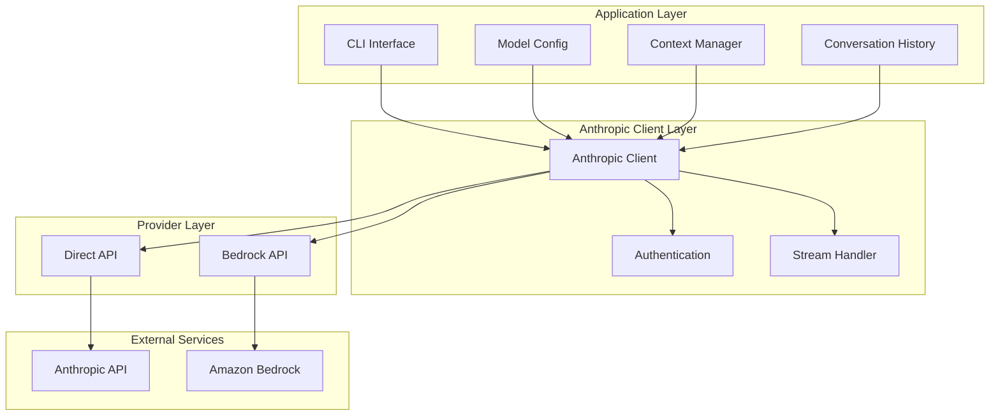

# Anthropic-Only Client Implementation Plan

A comprehensive step-by-step plan to convert the OpenAI client to support only Anthropic's Claude models through both direct API access and Amazon Bedrock.

## Executive Summary

This plan outlines the complete conversion of the existing OpenAI client to become a dedicated Anthropic client supporting Claude models through both direct Anthropic API access and Amazon Bedrock. The implementation removes OpenAI dependencies entirely and focuses on optimizing for Anthropic's API patterns and capabilities.

**Estimated Timeline**: 2-3 weeks
**Complexity**: Medium (simplified by removing multi-provider abstraction)
**Risk Level**: Low (clean conversion without backward compatibility constraints)

## Architecture Design

### Simplified Architecture



### Core Components

#### 1. Anthropic Client Structure
```go
type AnthropicClient struct {
    // Configuration
    provider    string // "direct" or "bedrock"
    baseURL     string // For direct API
    region      string // For Bedrock
    version     string // Anthropic API version
    
    // Core functionality
    httpClient  *http.Client
    context     []ContextFile
    model       *ModelDefinition
    history     *ConversationHistory
    showContext bool
    
    // Bedrock-specific
    bedrockClient *bedrockruntime.Client
    
    // Performance tracking
    lastMetrics *PerfMetrics
}
```

#### 2. Simplified Model Definition
```go
type ModelDefinition struct {
    Name       string                 `json:"name"`        // Claude model name
    Provider   string                 `json:"provider"`    // "direct" or "bedrock"
    Region     string                 `json:"region,omitempty"` // For Bedrock
    Parameters AnthropicParameters    `json:"parameters"`
    System     string                 `json:"system"`
    Format     string                 `json:"format,omitempty"`
}

type AnthropicParameters struct {
    MaxTokens     int       `json:"max_tokens"`
    Temperature   float64   `json:"temperature,omitempty"`
    TopP          float64   `json:"top_p,omitempty"`
    TopK          int       `json:"top_k,omitempty"`
    StopSequences []string  `json:"stop_sequences,omitempty"`
}
```

#### 3. Anthropic Message Format
```go
type AnthropicMessage struct {
    Role    string             `json:"role"`    // "user" or "assistant"
    Content []AnthropicContent `json:"content"`
}

type AnthropicContent struct {
    Type   string `json:"type"`   // "text" or "image"
    Text   string `json:"text,omitempty"`
    Source *ImageSource `json:"source,omitempty"`
}

type ImageSource struct {
    Type      string `json:"type"`       // "base64"
    MediaType string `json:"media_type"` // "image/jpeg", etc.
    Data      string `json:"data"`       // base64 data
}
```

## Implementation Plan

### Phase 1: Core Anthropic Direct API (Week 1)

#### Step 1.1: Remove OpenAI Dependencies
**Duration**: 0.5 days
**Files**: `main.go`, `go.mod`

```bash
# Remove OpenAI-specific code and structures
- Remove OpenAIChatRequest/Response structs
- Remove OpenAI authentication logic
- Remove OpenAI-specific parameter mappings
- Remove OpenAI context window logic
```

#### Step 1.2: Implement Core Anthropic Structures
**Duration**: 1 day
**Files**: `main.go`

```go
// New Anthropic-specific request structure
type AnthropicRequest struct {
    Model       string             `json:"model"`
    MaxTokens   int                `json:"max_tokens"`
    Messages    []AnthropicMessage `json:"messages"`
    System      string             `json:"system,omitempty"`
    Temperature *float64           `json:"temperature,omitempty"`
    TopP        *float64           `json:"top_p,omitempty"`
    TopK        *int               `json:"top_k,omitempty"`
    Stream      bool               `json:"stream,omitempty"`
    StopSequences []string         `json:"stop_sequences,omitempty"`
}

type AnthropicResponse struct {
    ID         string             `json:"id"`
    Type       string             `json:"type"`
    Role       string             `json:"role"`
    Content    []AnthropicContent `json:"content"`
    Model      string             `json:"model"`
    StopReason string             `json:"stop_reason"`
    Usage      AnthropicUsage     `json:"usage"`
}

type AnthropicUsage struct {
    InputTokens  int `json:"input_tokens"`
    OutputTokens int `json:"output_tokens"`
}
```

**Testing**: Unit tests for struct marshaling/unmarshaling.

#### Step 1.3: Implement Anthropic Authentication
**Duration**: 0.5 days

```go
func (c *AnthropicClient) addAuthHeaders(req *http.Request) error {
    apiKey := os.Getenv("ANTHROPIC_API_KEY")
    if apiKey == "" {
        return fmt.Errorf("ANTHROPIC_API_KEY environment variable is required")
    }
    
    req.Header.Set("x-api-key", apiKey)
    req.Header.Set("anthropic-version", "2023-06-01")
    req.Header.Set("Content-Type", "application/json")
    
    return nil
}
```

**Testing**: Authentication header validation tests.

#### Step 1.4: Implement Basic Chat Functionality
**Duration**: 2 days

```go
func (c *AnthropicClient) Chat(ctx context.Context, userMessage string) error {
    metrics := &PerfMetrics{}
    metrics.start()
    
    // Add user message to history
    c.history.AddUserMessage(userMessage)
    
    // Build request
    req := &AnthropicRequest{
        Model:     c.model.Name,
        MaxTokens: c.model.Parameters.MaxTokens,
        Messages:  c.convertHistoryToAnthropicFormat(),
        System:    c.model.System,
        Stream:    true,
    }
    
    // Apply parameters
    if c.model.Parameters.Temperature > 0 {
        req.Temperature = &c.model.Parameters.Temperature
    }
    if c.model.Parameters.TopP > 0 {
        req.TopP = &c.model.Parameters.TopP
    }
    if c.model.Parameters.TopK > 0 {
        req.TopK = &c.model.Parameters.TopK
    }
    if len(c.model.Parameters.StopSequences) > 0 {
        req.StopSequences = c.model.Parameters.StopSequences
    }
    
    if req.Stream {
        return c.handleStreamingResponse(ctx, req, metrics)
    } else {
        return c.handleNonStreamingResponse(ctx, req, metrics)
    }
}

func (c *AnthropicClient) convertHistoryToAnthropicFormat() []AnthropicMessage {
    var messages []AnthropicMessage
    
    for _, msg := range c.history.Messages {
        if msg.Role == "system" {
            continue // System messages handled separately
        }
        
        anthMsg := AnthropicMessage{
            Role: msg.Role,
            Content: []AnthropicContent{{
                Type: "text",
                Text: msg.Content,
            }},
        }
        messages = append(messages, anthMsg)
    }
    
    return messages
}
```

**Testing**: Basic chat functionality tests with mock responses.

#### Step 1.5: Implement Streaming Response Handling
**Duration**: 1 day

```go
func (c *AnthropicClient) handleStreamingResponse(ctx context.Context, req *AnthropicRequest, metrics *PerfMetrics) error {
    jsonBody, err := json.Marshal(req)
    if err != nil {
        return fmt.Errorf("failed to marshal request: %v", err)
    }
    
    httpReq, err := http.NewRequestWithContext(ctx, "POST", 
        c.baseURL+"/v1/messages", bytes.NewReader(jsonBody))
    if err != nil {
        return fmt.Errorf("failed to create request: %v", err)
    }
    
    if err := c.addAuthHeaders(httpReq); err != nil {
        return fmt.Errorf("failed to add auth headers: %v", err)
    }
    
    resp, err := c.httpClient.Do(httpReq)
    if err != nil {
        return fmt.Errorf("failed to send request: %v", err)
    }
    defer resp.Body.Close()
    
    if resp.StatusCode != http.StatusOK {
        body, _ := io.ReadAll(resp.Body)
        return fmt.Errorf("API request failed with status %d: %s", resp.StatusCode, string(body))
    }
    
    var fullResponse strings.Builder
    
    scanner := bufio.NewScanner(resp.Body)
    for scanner.Scan() {
        line := scanner.Text()
        
        if strings.HasPrefix(line, "event: ") {
            event := strings.TrimPrefix(line, "event: ")
            
            // Read the data line
            if !scanner.Scan() {
                break
            }
            dataLine := scanner.Text()
            
            if strings.HasPrefix(dataLine, "data: ") {
                data := strings.TrimPrefix(dataLine, "data: ")
                content := c.parseStreamEvent(event, data)
                
                if content != "" {
                    fullResponse.WriteString(content)
                    fmt.Print(content)
                    metrics.addTokens(content)
                }
            }
        }
    }
    
    metrics.finish()
    fmt.Print(metrics)
    
    // Add response to history
    c.history.AddAssistantMessage(fullResponse.String())
    
    return nil
}

func (c *AnthropicClient) parseStreamEvent(event, data string) string {
    switch event {
    case "content_block_delta":
        var delta struct {
            Type  string `json:"type"`
            Index int    `json:"index"`
            Delta struct {
                Type string `json:"type"`
                Text string `json:"text"`
            } `json:"delta"`
        }
        if err := json.Unmarshal([]byte(data), &delta); err == nil {
            return delta.Delta.Text
        }
    }
    return ""
}
```

**Testing**: Streaming integration tests with real API.

### Phase 2: Context Window and Management (Week 1-2)

#### Step 2.1: Implement Claude Context Window Logic
**Duration**: 1 day

```go
func (c *AnthropicClient) getContextWindow() int {
    // All Claude models have 200k context window
    return 200000
}

func (c *AnthropicClient) getContextStats() ContextStats {
    windowSize := c.getContextWindow()
    
    // Calculate tokens from context files
    var contextTokens int
    for _, file := range c.context {
        contextTokens += estimateTokenCount(file.Content)
    }
    
    // Calculate tokens from history
    var historyTokens int
    if c.history != nil {
        historyTokens = c.history.EstimateTokenCount()
    }
    
    // Calculate system prompt tokens
    var systemTokens int
    if c.model != nil && c.model.System != "" {
        systemTokens = estimateTokenCount(c.model.System)
    }
    
    totalTokens := contextTokens + historyTokens + systemTokens
    remaining := windowSize - totalTokens
    if remaining < 0 {
        remaining = 0
    }
    
    return ContextStats{
        WindowSize:      windowSize,
        UsedTokens:      totalTokens,
        RemainingTokens: remaining,
        UsagePercent:    float64(totalTokens) / float64(windowSize) * 100,
    }
}
```

**Testing**: Context calculation tests with various scenarios.

#### Step 2.2: Update Token Estimation for Claude
**Duration**: 0.5 days

```go
// Update token estimation for Claude models
func estimateTokenCount(text string) int {
    // Claude models generally use similar tokenization to GPT models
    // ~4 characters per token for English text
    chars := len(text)
    words := len(strings.Fields(text))
    
    if words == 0 {
        return chars / 4
    }
    
    // Claude tends to be slightly more efficient with tokens
    avgWordLength := float64(chars) / float64(words)
    
    if avgWordLength < 4 {
        return int(float64(chars) * 0.28) // ~3.6 chars per token
    } else if avgWordLength > 6 {
        return int(float64(chars) * 0.18) // ~5.5 chars per token
    }
    
    return chars / 4 // Default 4 chars per token
}
```

**Testing**: Token estimation accuracy tests.

### Phase 3: Amazon Bedrock Integration (Week 2)

#### Step 3.1: Add Bedrock Dependencies
**Duration**: 0.5 days

```bash
go get github.com/aws/aws-sdk-go-v2/config
go get github.com/aws/aws-sdk-go-v2/service/bedrockruntime
go get github.com/aws/aws-sdk-go-v2/credentials
```

#### Step 3.2: Implement Bedrock Support
**Duration**: 2 days

```go
func (c *AnthropicClient) initBedrockClient() error {
    if c.provider != "bedrock" {
        return nil
    }
    
    cfg, err := config.LoadDefaultConfig(context.TODO(),
        config.WithRegion(c.region))
    if err != nil {
        return fmt.Errorf("failed to load AWS config: %v", err)
    }
    
    c.bedrockClient = bedrockruntime.NewFromConfig(cfg)
    return nil
}

func (c *AnthropicClient) chatViaBedrock(ctx context.Context, req *AnthropicRequest) error {
    // Convert Anthropic format to Bedrock format
    prompt := c.convertToBedrockPrompt(req.Messages, req.System)
    
    bedrockReq := map[string]interface{}{
        "prompt":               prompt,
        "max_tokens_to_sample": req.MaxTokens,
    }
    
    if req.Temperature != nil {
        bedrockReq["temperature"] = *req.Temperature
    }
    if req.TopP != nil {
        bedrockReq["top_p"] = *req.TopP
    }
    if req.TopK != nil {
        bedrockReq["top_k"] = *req.TopK
    }
    if len(req.StopSequences) > 0 {
        bedrockReq["stop_sequences"] = req.StopSequences
    }
    
    jsonBody, err := json.Marshal(bedrockReq)
    if err != nil {
        return fmt.Errorf("failed to marshal bedrock request: %v", err)
    }
    
    input := &bedrockruntime.InvokeModelInput{
        ModelId:     aws.String(c.model.Name),
        Body:        jsonBody,
        ContentType: aws.String("application/json"),
    }
    
    if req.Stream {
        return c.handleBedrockStreaming(ctx, input)
    } else {
        return c.handleBedrockNonStreaming(ctx, input)
    }
}

func (c *AnthropicClient) convertToBedrockPrompt(messages []AnthropicMessage, systemPrompt string) string {
    var prompt strings.Builder
    
    if systemPrompt != "" {
        prompt.WriteString(fmt.Sprintf("System: %s\n\n", systemPrompt))
    }
    
    for _, msg := range messages {
        var content strings.Builder
        for _, c := range msg.Content {
            if c.Type == "text" {
                content.WriteString(c.Text)
            }
        }
        
        switch msg.Role {
        case "user":
            prompt.WriteString(fmt.Sprintf("Human: %s\n\n", content.String()))
        case "assistant":
            prompt.WriteString(fmt.Sprintf("Assistant: %s\n\n", content.String()))
        }
    }
    
    prompt.WriteString("Assistant: ")
    return prompt.String()
}
```

**Testing**: Bedrock integration tests with AWS credentials.

#### Step 3.3: Implement Bedrock Streaming
**Duration**: 1 day

```go
func (c *AnthropicClient) handleBedrockStreaming(ctx context.Context, input *bedrockruntime.InvokeModelInput) error {
    streamInput := &bedrockruntime.InvokeModelWithResponseStreamInput{
        ModelId:     input.ModelId,
        Body:        input.Body,
        ContentType: input.ContentType,
    }
    
    result, err := c.bedrockClient.InvokeModelWithResponseStream(ctx, streamInput)
    if err != nil {
        return fmt.Errorf("bedrock streaming invoke failed: %v", err)
    }
    
    defer result.GetStream().Close()
    
    var fullResponse strings.Builder
    metrics := &PerfMetrics{}
    metrics.start()
    
    for event := range result.GetStream().Events() {
        switch e := event.(type) {
        case *types.ResponseStreamMemberChunk:
            var chunk struct {
                Completion string `json:"completion"`
                StopReason string `json:"stop_reason"`
            }
            
            if err := json.Unmarshal(e.Value.Bytes, &chunk); err != nil {
                continue
            }
            
            if chunk.Completion != "" {
                fullResponse.WriteString(chunk.Completion)
                fmt.Print(chunk.Completion)
                metrics.addTokens(chunk.Completion)
            }
            
            if chunk.StopReason != "" {
                break
            }
        }
    }
    
    metrics.finish()
    fmt.Print(metrics)
    
    c.history.AddAssistantMessage(fullResponse.String())
    return nil
}
```

**Testing**: Bedrock streaming tests.

### Phase 4: Configuration and CLI Updates (Week 2-3)

#### Step 4.1: Update Model Configuration Format
**Duration**: 1 day

Create new Anthropic-specific model configurations:

**Claude 3.5 Sonnet Direct API**:
```json
{
  "name": "claude-3-5-sonnet-20241022",
  "provider": "direct",
  "parameters": {
    "max_tokens": 4096,
    "temperature": 0.7,
    "top_p": 0.9,
    "top_k": 40,
    "stop_sequences": []
  },
  "system": "You are a helpful assistant with expertise in software development.",
  "format": "markdown"
}
```

**Claude 3.5 Sonnet via Bedrock**:
```json
{
  "name": "anthropic.claude-3-5-sonnet-20241022-v2:0",
  "provider": "bedrock",
  "region": "us-east-1",
  "parameters": {
    "max_tokens": 4096,
    "temperature": 0.7,
    "top_p": 0.9,
    "top_k": 40,
    "stop_sequences": []
  },
  "system": "You are a helpful assistant with expertise in software development.",
  "format": "markdown"
}
```

**Testing**: Configuration validation tests.

#### Step 4.2: Update CLI Flags
**Duration**: 0.5 days

```go
func main() {
    var flags struct {
        provider     string
        region       string
        prompt       string
        modelConfig  string
        defaultModel string
        showContext  bool
    }
    
    flag.StringVar(&flags.provider, "provider", "direct", "Provider to use: direct or bedrock")
    flag.StringVar(&flags.region, "region", "us-east-1", "AWS region for Bedrock")
    flag.StringVar(&flags.prompt, "prompt", "", "Path to initial prompt file")
    flag.StringVar(&flags.modelConfig, "model", "", "Path to model configuration file")
    flag.StringVar(&flags.defaultModel, "default-model", "claude-3-5-sonnet-20241022", "Default model to use")
    flag.BoolVar(&flags.showContext, "context", false, "Show prompts and context before sending")
    flag.BoolVar(&flags.showContext, "c", false, "Show prompts and context before sending (shorthand)")
    flag.Parse()
    
    // Create Anthropic client
    client := &AnthropicClient{
        provider:     flags.provider,
        region:       flags.region,
        baseURL:      "https://api.anthropic.com",
        httpClient:   &http.Client{},
        defaultModel: flags.defaultModel,
        history:      NewConversationHistory(""),
        showContext:  flags.showContext,
    }
    
    // Initialize based on provider
    if flags.provider == "bedrock" {
        if err := client.initBedrockClient(); err != nil {
            log.Fatalf("Failed to initialize Bedrock client: %v", err)
        }
    }
    
    // Rest of main function...
}
```

**Testing**: CLI flag validation tests.

#### Step 4.3: Update Interactive Commands
**Duration**: 1 day

Update commands for Anthropic-specific functionality:

```go
func (c *AnthropicClient) showStatus() {
    fmt.Println("\n=== Anthropic Client Status ===")
    
    // Provider info
    fmt.Printf("Provider: %s\n", c.provider)
    if c.provider == "bedrock" {
        fmt.Printf("Region: %s\n", c.region)
    }
    
    // Model info
    if c.model != nil {
        fmt.Printf("Model: %s\n", c.model.Name)
        fmt.Printf("Provider: %s\n", c.model.Provider)
        if c.model.System != "" {
            fmt.Printf("System: %s\n", c.model.System)
        }
        
        // Show active parameters
        params := c.model.Parameters
        fmt.Println("\nActive Parameters:")
        fmt.Printf("  Max Tokens: %d\n", params.MaxTokens)
        if params.Temperature > 0 {
            fmt.Printf("  Temperature: %.2f\n", params.Temperature)
        }
        if params.TopP > 0 {
            fmt.Printf("  Top P: %.2f\n", params.TopP)
        }
        if params.TopK > 0 {
            fmt.Printf("  Top K: %d\n", params.TopK)
        }
        if len(params.StopSequences) > 0 {
            fmt.Printf("  Stop Sequences: %v\n", params.StopSequences)
        }
    } else {
        fmt.Printf("Model: %s (default)\n", c.defaultModel)
    }
    
    // Context stats
    stats := c.getContextStats()
    fmt.Printf("\nContext Window: %d tokens\n", stats.WindowSize)
    fmt.Printf("Used: %d tokens (%.1f%%)\n", stats.UsedTokens, stats.UsagePercent)
    fmt.Printf("Remaining: %d tokens\n", stats.RemainingTokens)
    
    // Context files
    if len(c.context) > 0 {
        fmt.Println("\nLoaded Context Files:")
        for _, file := range c.context {
            tokens := estimateTokenCount(file.Content)
            fmt.Printf("  %s (%s, ~%d tokens)\n", file.Name, file.Language, tokens)
        }
    }
    
    fmt.Println()
}
```

**Testing**: Interactive command tests.

### Phase 5: Testing and Documentation (Week 3)

#### Step 5.1: Comprehensive Testing

##### Unit Tests
```bash
# Test core functionality
go test ./anthropic_test.go -v

# Test parameter mapping
go test ./parameters_test.go -v

# Test message conversion
go test ./messages_test.go -v

# Test context management
go test ./context_test.go -v
```

##### Integration Tests
```bash
# Test direct Anthropic API
ANTHROPIC_API_KEY=sk-ant-... go test ./integration/direct_test.go -v

# Test Bedrock integration
AWS_PROFILE=bedrock go test ./integration/bedrock_test.go -v
```

##### Manual Testing Scenarios
- [ ] Basic chat with Claude 3.5 Sonnet (direct)
- [ ] Basic chat with Claude 3.5 Sonnet (Bedrock)
- [ ] File loading and context management
- [ ] Streaming responses
- [ ] Interactive commands
- [ ] Model configuration loading
- [ ] Provider switching between direct and Bedrock
- [ ] Error handling (missing API keys, network issues)
- [ ] Context window management and trimming

#### Step 5.2: Create Example Configurations

**Default Claude 3.5 Sonnet**:
```json
{
  "name": "claude-3-5-sonnet-20241022",
  "provider": "direct",
  "parameters": {
    "max_tokens": 4096,
    "temperature": 0.7,
    "top_p": 0.9
  },
  "system": "You are a helpful assistant."
}
```

**Claude 3 Opus for Complex Tasks**:
```json
{
  "name": "claude-3-opus-20240229",
  "provider": "direct",
  "parameters": {
    "max_tokens": 4096,
    "temperature": 0.3,
    "top_p": 0.9,
    "top_k": 10
  },
  "system": "You are an expert analyst capable of deep reasoning and complex problem solving."
}
```

**Claude 3 Haiku for Fast Responses**:
```json
{
  "name": "claude-3-haiku-20240307",
  "provider": "direct",
  "parameters": {
    "max_tokens": 2048,
    "temperature": 0.8,
    "top_p": 0.95
  },
  "system": "You are a quick and helpful assistant."
}
```

**Bedrock Claude 3.5 Sonnet**:
```json
{
  "name": "anthropic.claude-3-5-sonnet-20241022-v2:0",
  "provider": "bedrock",
  "region": "us-east-1",
  "parameters": {
    "max_tokens": 4096,
    "temperature": 0.7,
    "top_p": 0.9
  },
  "system": "You are a helpful assistant."
}
```

#### Step 5.3: Update Documentation

Update README.md and CLAUDE.md files to reflect Anthropic-only functionality:

**Key Changes**:
- Remove all OpenAI references
- Update environment variables (ANTHROPIC_API_KEY, AWS credentials)
- Update model configuration examples
- Update CLI flag documentation
- Add Bedrock setup instructions

## Environment Variables

### For Direct Anthropic API
```bash
export ANTHROPIC_API_KEY="sk-ant-your-key-here"
```

### For Amazon Bedrock
```bash
export AWS_ACCESS_KEY_ID="your-access-key"
export AWS_SECRET_ACCESS_KEY="your-secret-key"
export AWS_REGION="us-east-1"
# OR
export AWS_PROFILE="your-profile-name"
```

## CLI Usage

### Basic Usage
```bash
# Default Claude 3.5 Sonnet via direct API
./client

# Use specific model configuration
./client -model claude-opus.json

# Use Bedrock
./client -provider bedrock -model claude-bedrock.json

# Show context before sending
./client -context -model claude-sonnet.json
```

### Interactive Commands
- `/load <file>` - Load file into context
- `/model <file>` - Load model configuration
- `/status` - Show client and model status
- `/history` - Display conversation history
- `/clear` - Clear conversation history
- `/dump` - Export context to file
- `/help` - Show available commands

## Performance Optimizations

### Claude-Specific Optimizations
1. **200K Context Window**: Take full advantage of Claude's large context window
2. **Efficient Tokenization**: Optimized token estimation for Claude models
3. **Streaming Performance**: Optimized for Anthropic's SSE format
4. **Parameter Tuning**: Claude-optimized default parameters

### Bedrock Optimizations
1. **Regional Deployment**: Choose optimal AWS regions
2. **Batch Processing**: Efficient request batching where applicable
3. **Credential Caching**: Optimized AWS credential handling

## Migration from OpenAI Client

### Breaking Changes
- **API Keys**: Must use ANTHROPIC_API_KEY instead of OPENAI_API_KEY
- **Model Names**: Must use Claude model names instead of GPT models
- **Configuration Format**: New parameter structure for Anthropic models
- **Context Windows**: All models now have 200K context window

### Migration Steps
1. **Update API Keys**: Set ANTHROPIC_API_KEY environment variable
2. **Update Model Configs**: Create new configurations with Anthropic model names
3. **Update CLI Usage**: Use new provider flags if using Bedrock
4. **Test Functionality**: Verify all features work with new models

### Model Mapping Guide
| Use Case | Recommended Claude Model | Configuration |
|----------|-------------------------|---------------|
| **General Chat** | Claude 3.5 Sonnet | claude-3-5-sonnet-20241022 |
| **Complex Analysis** | Claude 3 Opus | claude-3-opus-20240229 |
| **Fast Responses** | Claude 3 Haiku | claude-3-haiku-20240307 |
| **Coding Tasks** | Claude 3.5 Sonnet | claude-3-5-sonnet-20241022 |

## Success Metrics

### Functionality Metrics
- [ ] All core chat functionality working
- [ ] Streaming responses functional
- [ ] Context management optimized for 200K window
- [ ] Both direct API and Bedrock working
- [ ] Model configuration system functional

### Performance Metrics
- [ ] Response times competitive with OpenAI client
- [ ] Token estimation accuracy within 5%
- [ ] Memory usage optimized
- [ ] Context window fully utilized

### User Experience Metrics
- [ ] Simple migration from OpenAI client
- [ ] Clear documentation and examples
- [ ] Intuitive CLI interface
- [ ] Helpful error messages

## Timeline Summary

### Week 1: Core Implementation
- [ ] Remove OpenAI dependencies
- [ ] Implement Anthropic direct API
- [ ] Basic chat functionality
- [ ] Streaming support
- [ ] Context management

### Week 2: Bedrock Integration
- [ ] AWS SDK integration
- [ ] Bedrock API implementation
- [ ] Bedrock streaming support
- [ ] Provider switching logic
- [ ] Configuration updates

### Week 3: Testing and Polish
- [ ] Comprehensive testing
- [ ] Documentation updates
- [ ] Example configurations
- [ ] Performance optimization
- [ ] Final validation

## Conclusion

This implementation plan converts the existing OpenAI client into a dedicated Anthropic client, simplifying the architecture while providing robust support for both direct Anthropic API access and Amazon Bedrock integration. The removal of OpenAI dependencies allows for a cleaner, more focused implementation optimized specifically for Claude models and Anthropic's API patterns.

The result will be a powerful client that takes full advantage of Claude's capabilities, including the large 200K context window, advanced reasoning abilities, and enhanced safety features, while maintaining the familiar interface and workflow that users expect.