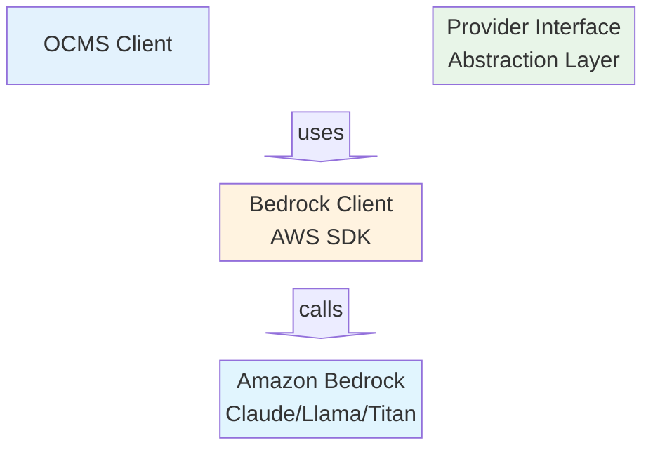

# Amazon Bedrock Migration Plan

## Executive Summary

This document outlines a plan to migrate the OpenAI client to use Amazon Bedrock instead of direct OpenAI API calls. 

**Critical Note**: OpenAI models (GPT-4, GPT-3.5-turbo, etc.) are **not available** through Amazon Bedrock. Bedrock provides access to models from Anthropic, AI21 Labs, Cohere, Meta, Stability AI, and Amazon Titan, but not OpenAI models.

## Available Options

### Option 1: Model Substitution (Recommended)
Replace OpenAI models with equivalent Bedrock models:
- **GPT-4** → **Anthropic Claude 3 Opus** (`anthropic.claude-3-opus-20240229-v1:0`)
- **GPT-4o/GPT-4o-mini** → **Anthropic Claude 3 Sonnet** (`anthropic.claude-3-sonnet-20240229-v1:0`)
- **GPT-3.5-turbo** → **Anthropic Claude 3 Haiku** (`anthropic.claude-3-haiku-20240307-v1:0`)

### Option 2: Hybrid Architecture
- Use Bedrock for specific models/use cases
- Maintain OpenAI direct access for GPT models
- Add provider abstraction layer

### Option 3: Multi-Provider Gateway
- Create unified interface supporting both Bedrock and OpenAI
- Route requests based on model availability and cost optimization

## Recommended Architecture (Option 1)

### High-Level Design


### Component Changes

#### 1. Provider Abstraction Layer
Create interface to support multiple model providers:

```go
type ModelProvider interface {
    SendChatRequest(ctx context.Context, req ChatRequest) (*ChatResponse, error)
    GetModels() []ModelInfo
    ValidateConfig(config ModelDefinition) error
}

type BedrockProvider struct {
    client *bedrock.Client
    region string
}

type OpenAIProvider struct {
    apiKey string
    baseURL string
}
```

#### 2. AWS Integration
Add AWS SDK dependencies and authentication:

```go
// Add to go.mod
require (
    github.com/aws/aws-sdk-go-v2 v1.24.0
    github.com/aws/aws-sdk-go-v2/config v1.26.1
    github.com/aws/aws-sdk-go-v2/service/bedrock v1.7.2
    github.com/aws/aws-sdk-go-v2/service/bedrockruntime v1.7.1
)
```

## Implementation Plan

### Phase 1: Foundation (Week 1)

#### 1.1 Add AWS SDK Dependencies
```bash
cd client
go get github.com/aws/aws-sdk-go-v2/config
go get github.com/aws/aws-sdk-go-v2/service/bedrockruntime
go get github.com/aws/aws-sdk-go-v2/credentials
```

#### 1.2 Create Provider Interface
```go
// providers/provider.go
type ChatRequest struct {
    Model       string
    Messages    []Message
    Parameters  map[string]interface{}
    Stream      bool
}

type ChatResponse struct {
    Content     string
    TokensUsed  int
    Model       string
    FinishReason string
}
```

#### 1.3 Implement Bedrock Provider
```go
// providers/bedrock.go
type BedrockProvider struct {
    client *bedrockruntime.Client
    region string
}

func NewBedrockProvider(region string) (*BedrockProvider, error) {
    cfg, err := config.LoadDefaultConfig(context.TODO(), 
        config.WithRegion(region))
    if err != nil {
        return nil, err
    }
    
    return &BedrockProvider{
        client: bedrockruntime.NewFromConfig(cfg),
        region: region,
    }, nil
}
```

### Phase 2: Model Mapping (Week 2)

#### 2.1 Update Model Definitions
Create Bedrock-specific model configurations:

```json
// claude-3-sonnet.json
{
  "name": "anthropic.claude-3-sonnet-20240229-v1:0",
  "provider": "bedrock",
  "parameters": {
    "max_tokens": 4096,
    "temperature": 0.7,
    "top_p": 0.9,
    "stop_sequences": ["Human:", "Assistant:"]
  },
  "system": "You are a helpful assistant with expertise in software development.",
  "format": "markdown"
}
```

#### 2.2 Parameter Mapping
Map OpenAI parameters to Bedrock equivalents:

```go
// Map OpenAI parameters to Claude parameters
func mapParametersToClaude(openaiParams ModelParameters) map[string]interface{} {
    claudeParams := map[string]interface{}{
        "max_tokens": 4096,
    }
    
    if openaiParams.Temperature > 0 {
        claudeParams["temperature"] = openaiParams.Temperature
    }
    
    if openaiParams.TopP > 0 {
        claudeParams["top_p"] = openaiParams.TopP
    }
    
    return claudeParams
}
```

### Phase 3: Request/Response Handling (Week 3)

#### 3.1 Bedrock API Request Format
```go
func (bp *BedrockProvider) SendChatRequest(ctx context.Context, req ChatRequest) (*ChatResponse, error) {
    // Convert messages to Claude format
    prompt := convertMessagesToClaudePrompt(req.Messages)
    
    // Prepare Bedrock request
    input := &bedrockruntime.InvokeModelInput{
        ModelId: aws.String(req.Model),
        Body: []byte(fmt.Sprintf(`{
            "prompt": "%s",
            "max_tokens_to_sample": %d,
            "temperature": %f,
            "top_p": %f
        }`, prompt, 4096, 0.7, 0.9)),
        ContentType: aws.String("application/json"),
    }
    
    result, err := bp.client.InvokeModel(ctx, input)
    if err != nil {
        return nil, err
    }
    
    return parseClaudeResponse(result.Body)
}
```

#### 3.2 Streaming Support
```go
func (bp *BedrockProvider) SendStreamingRequest(ctx context.Context, req ChatRequest) (<-chan ChatResponse, error) {
    input := &bedrockruntime.InvokeModelWithResponseStreamInput{
        ModelId: aws.String(req.Model),
        Body: prepareStreamingRequest(req),
        ContentType: aws.String("application/json"),
    }
    
    result, err := bp.client.InvokeModelWithResponseStream(ctx, input)
    if err != nil {
        return nil, err
    }
    
    responseChan := make(chan ChatResponse)
    go processStreamingResponse(result.GetStream(), responseChan)
    
    return responseChan, nil
}
```

### Phase 4: Configuration Updates (Week 4)

#### 4.1 Environment Variables
Update authentication to use AWS credentials:

```bash
# Replace OpenAI credentials
# OPENAI_API_KEY=sk-xxx  # Remove

# Add AWS credentials
export AWS_ACCESS_KEY_ID=your-access-key
export AWS_SECRET_ACCESS_KEY=your-secret-key
export AWS_REGION=us-east-1
export BEDROCK_REGION=us-east-1  # Bedrock-specific region
```

#### 4.2 Configuration File Updates
```go
// Update ModelDefinition struct
type ModelDefinition struct {
    Name       string          `json:"name"`
    Provider   string          `json:"provider"`   // "openai" or "bedrock"
    Region     string          `json:"region,omitempty"`     // For Bedrock
    Parameters ModelParameters `json:"parameters"`
    System     string          `json:"system"`
    Format     string          `json:"format,omitempty"`
}
```

#### 4.3 Provider Selection Logic
```go
func createProvider(modelDef ModelDefinition) (ModelProvider, error) {
    switch modelDef.Provider {
    case "bedrock":
        return NewBedrockProvider(modelDef.Region)
    case "openai":
        return NewOpenAIProvider()
    default:
        return nil, fmt.Errorf("unsupported provider: %s", modelDef.Provider)
    }
}
```

## Code Changes Required

### 1. Main Application Changes
```go
// main.go modifications
type OpenAIClient struct {
    provider    ModelProvider  // Changed from direct HTTP client
    model       ModelDefinition
    history     *ConversationHistory
    context     []ContextFile
    performance *PerfMetrics
}

func (c *OpenAIClient) sendChatRequest(messages []Message) error {
    req := ChatRequest{
        Model:      c.model.Name,
        Messages:   messages,
        Parameters: convertParameters(c.model.Parameters),
        Stream:     true,
    }
    
    response, err := c.provider.SendChatRequest(context.Background(), req)
    if err != nil {
        return err
    }
    
    // Process response...
    return nil
}
```

### 2. Error Handling Updates
```go
// Handle Bedrock-specific errors
func handleBedrockError(err error) error {
    if strings.Contains(err.Error(), "ValidationException") {
        return fmt.Errorf("invalid request parameters: %w", err)
    }
    if strings.Contains(err.Error(), "ThrottlingException") {
        return fmt.Errorf("rate limit exceeded, please retry: %w", err)
    }
    return err
}
```

### 3. Context Window Management
```go
// Update context window detection for Bedrock models
func (c *OpenAIClient) getContextWindow() int {
    switch {
    case strings.Contains(c.model.Name, "claude-3-opus"):
        return 200000  // Claude 3 Opus context window
    case strings.Contains(c.model.Name, "claude-3-sonnet"):
        return 200000  // Claude 3 Sonnet context window
    case strings.Contains(c.model.Name, "claude-3-haiku"):
        return 200000  // Claude 3 Haiku context window
    case strings.Contains(c.model.Name, "llama2-70b"):
        return 4096    // Llama 2 context window
    default:
        return 4096    // Conservative default
    }
}
```

## Migration Steps

### Step 1: Preparation
1. **Set up AWS Account and Bedrock Access**
   - Enable Amazon Bedrock in your AWS account
   - Request access to desired models (Claude, Llama, etc.)
   - Create IAM role with Bedrock permissions

2. **Configure AWS Credentials**
   ```bash
   aws configure
   # Or use environment variables
   export AWS_ACCESS_KEY_ID=your-key
   export AWS_SECRET_ACCESS_KEY=your-secret
   export AWS_REGION=us-east-1
   ```

### Step 2: Code Implementation
1. **Add provider abstraction layer**
2. **Implement Bedrock provider**
3. **Update model configurations**
4. **Test with single model**

### Step 3: Testing
1. **Unit Tests**
   ```bash
   go test ./providers/...
   ```

2. **Integration Tests**
   ```bash
   ./client -model claude-3-sonnet.json -prompt test-prompt.txt
   ```

3. **Performance Comparison**
   - Compare response times between OpenAI and Bedrock
   - Measure token counting accuracy
   - Test context window limits

### Step 4: Gradual Migration
1. **Start with development environment**
2. **Migrate non-critical use cases first**
3. **Monitor performance and costs**
4. **Complete migration based on results**

## New Model Configuration Examples

### Claude 3 Sonnet Configuration
```json
{
  "name": "anthropic.claude-3-sonnet-20240229-v1:0",
  "provider": "bedrock",
  "region": "us-east-1",
  "parameters": {
    "max_tokens": 4096,
    "temperature": 0.7,
    "top_p": 0.9,
    "stop_sequences": []
  },
  "system": "You are a helpful assistant with expertise in software development.",
  "format": "markdown"
}
```

### Llama 2 70B Configuration
```json
{
  "name": "meta.llama2-70b-chat-v1",
  "provider": "bedrock",
  "region": "us-west-2",
  "parameters": {
    "max_gen_len": 2048,
    "temperature": 0.7,
    "top_p": 0.9
  },
  "system": "You are a helpful assistant.",
  "format": "markdown"
}
```

## Cost and Performance Considerations

### Cost Comparison
- **Bedrock**: Pay-per-token pricing, varies by model
- **OpenAI Direct**: Different pricing structure
- **Additional Costs**: AWS data transfer, potential cross-region charges

### Performance Factors
- **Latency**: Bedrock may have different latency characteristics
- **Throughput**: Rate limits differ between providers
- **Model Capabilities**: Different strengths between OpenAI and Bedrock models

### Monitoring
```go
// Add AWS cost tracking
type CostMetrics struct {
    InputTokens   int
    OutputTokens  int
    ModelInvocations int
    EstimatedCost float64
}
```

## Security and Compliance

### IAM Permissions
```json
{
  "Version": "2012-10-17",
  "Statement": [
    {
      "Effect": "Allow",
      "Action": [
        "bedrock:InvokeModel",
        "bedrock:InvokeModelWithResponseStream"
      ],
      "Resource": [
        "arn:aws:bedrock:us-east-1::foundation-model/anthropic.claude-3-sonnet-20240229-v1:0",
        "arn:aws:bedrock:us-east-1::foundation-model/anthropic.claude-3-opus-20240229-v1:0"
      ]
    }
  ]
}
```

### Data Privacy
- **AWS Region Selection**: Choose regions for data sovereignty
- **Logging**: Configure CloudTrail for audit trails
- **Encryption**: Enable encryption in transit and at rest

## Rollback Plan

### Immediate Rollback
1. **Switch provider flag**:
   ```bash
   ./client -provider openai -model gpt-4o-mini.json
   ```

2. **Environment variable override**:
   ```bash
   export FORCE_OPENAI_PROVIDER=true
   ```

### Configuration Rollback
1. Keep original OpenAI model configurations
2. Maintain dual configuration support
3. Document rollback procedures

## Success Metrics

### Technical Metrics
- **Response Time**: Compare average response times
- **Error Rates**: Monitor API error rates
- **Token Accuracy**: Verify token counting precision
- **Context Window Utilization**: Measure context usage efficiency

### Business Metrics
- **Cost Reduction**: Track monthly API costs
- **Performance Improvement**: Measure user satisfaction
- **Reliability**: Monitor uptime and availability

## Conclusion

This migration plan provides a structured approach to transitioning from direct OpenAI API usage to Amazon Bedrock. Key benefits include:

- **Cost Optimization**: Potential cost savings depending on usage patterns
- **AWS Integration**: Better integration with existing AWS infrastructure
- **Model Diversity**: Access to multiple model providers through single interface
- **Compliance**: Enhanced compliance options through AWS

The recommended approach prioritizes backward compatibility and gradual migration to minimize risk and ensure smooth transition.