# Anthropic Client

An advanced interactive CLI client for Anthropic's API with sophisticated context management, performance monitoring, and model configuration capabilities.

## Overview

This client provides a rich interactive interface for working with Anthropic models, featuring intelligent context management, real-time performance metrics, and flexible model configuration through JSON files.

## Features

### 🎯 Core Capabilities
- **Interactive CLI**: Rich command-line interface with history and completion
- **Streaming Responses**: Real-time response display with performance metrics
- **Model Configuration**: JSON-based model definitions with parameter control
- **Context Management**: Intelligent file loading with automatic token counting
- **Performance Monitoring**: Real-time tokens/sec, response time, and context usage

### 🛠️ Interactive Commands
- `/load <file>` - Load source files into context
- `/model <file>` - Switch model configuration  
- `/status` - Show current model, context usage, token counts
- `/history` - Display conversation history
- `/clear` - Clear conversation history
- `/dump` - Export context to file
- `/help` - Show available commands

### 📊 Performance Metrics
Automatically displays after each interaction:
```
[Performance: 123.45 tokens/sec, 150 total tokens, response time: 1.234s]
```

## Quick Start

### Prerequisites
- Go 1.19+
- Anthropic API key

### Setup and Run
```bash
# Set API key
export ANTHROPIC_API_KEY="sk-ant-your-api-key-here"

# Build and run
make run

# Or manually
go build -o client . && ./client
```

## Usage

### Command Line Options
```bash
./client [flags]

Flags:
  -model string     Path to model definition file (JSON format)
  -prompt string    Path to initial prompt file
  -url string       Anthropic API base URL (default: https://api.anthropic.com)
  -default-model    Default model to use (default: claude-3-5-sonnet-20241022)
  -context, -c      Show full context before sending to LLM
```

### Examples
```bash
# Basic interactive chat
./client

# Using custom model configuration
./client -model claude-3-5-sonnet.json

# Starting with initial prompt
./client -model claude-3-5-haiku.json -prompt test-prompt.txt

# Show context before sending
./client -context -model claude-3-opus.json
```

## Architecture Overview

The client follows a modular architecture with clear separation of concerns:

### High-Level System Architecture

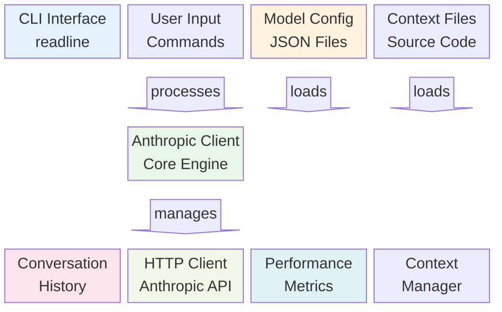

## Core Components Analysis

### 1. Data Structures

#### ModelDefinition Structure
The `ModelDefinition` struct encapsulates all model configuration:

```go
type ModelDefinition struct {
    Name       string          // Anthropic model name (e.g., "claude-3-5-sonnet-20241022")
    Modelfile  string          // Legacy Ollama support
    Parameters ModelParameters // API parameters (temperature, top_p, etc.)
    Options    ModelOptions    // Model options (context window, etc.)
    Template   string          // Message formatting template
    System     string          // System prompt
    Format     string          // Response format (markdown, json)
}
```

#### Message and Conversation Management
```go
type Message struct {
    Role    string // "system", "user", "assistant"
    Content string // Message content
}

type ConversationHistory struct {
    Messages []Message // Ordered conversation messages
}
```

#### Performance Tracking
```go
type PerfMetrics struct {
    startTime       time.Time     // Request start time
    totalTokens     int           // Response tokens counted
    responseTime    time.Duration // Total response time
    windowSize      int           // Context window size
    usedTokens      int           // Current context usage
    remainingTokens int           // Available context space
}
```

### 2. Anthropic Client Core Engine

The `AnthropicClient` serves as the central orchestrator:

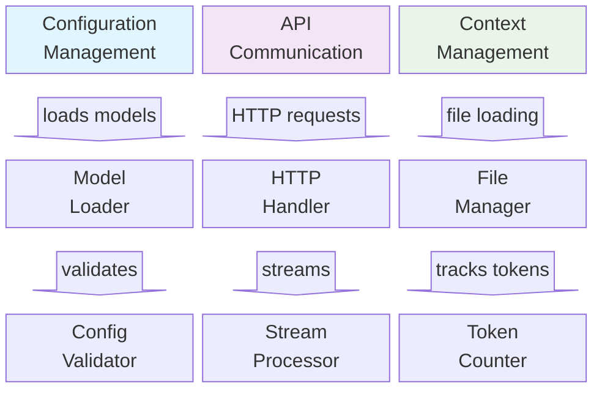

## Functional Flow Analysis

### 1. Application Startup Sequence

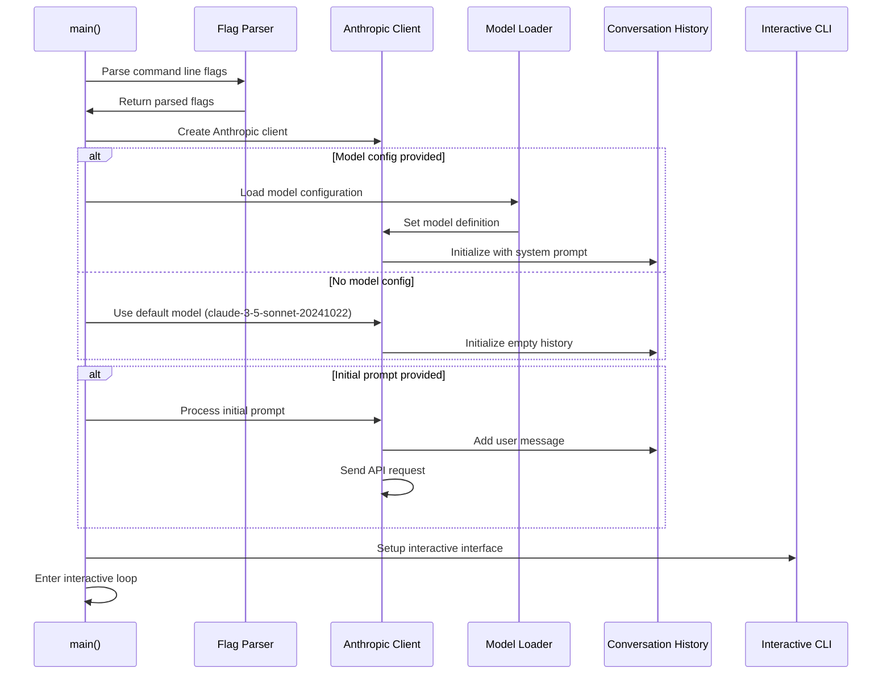

### 2. Interactive Command Processing

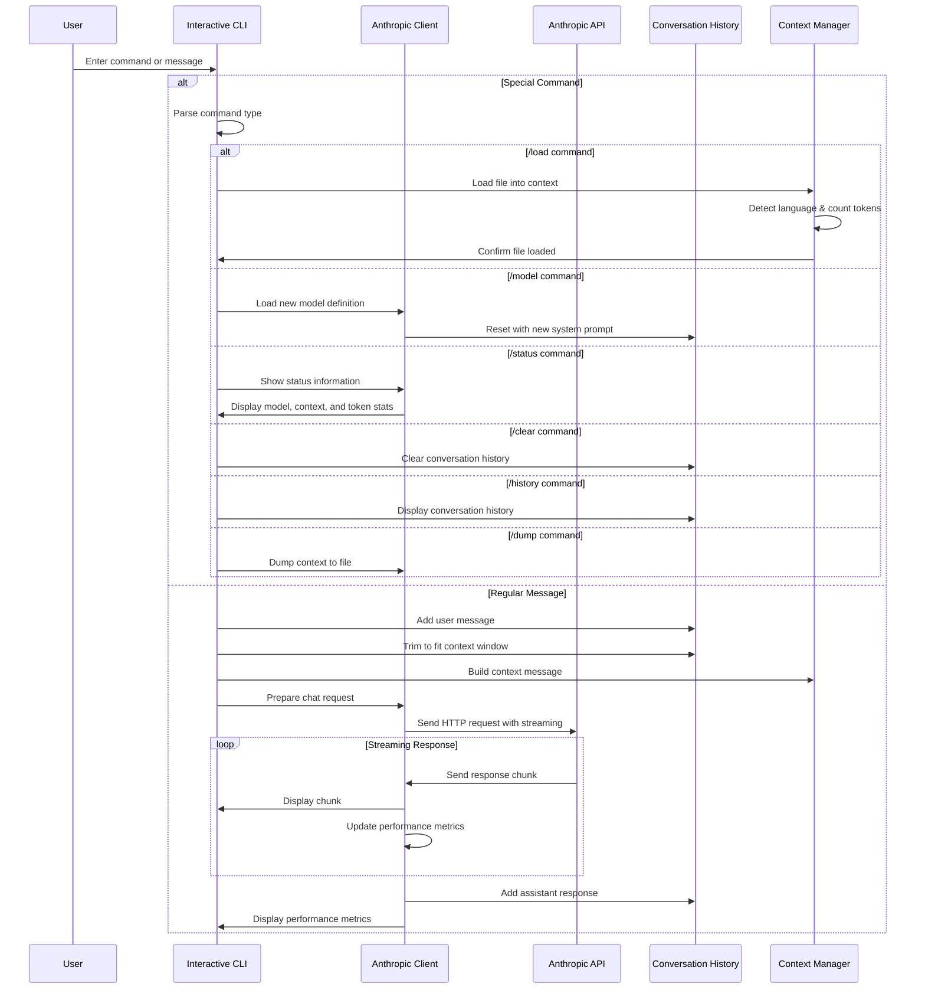

### 3. API Communication Flow

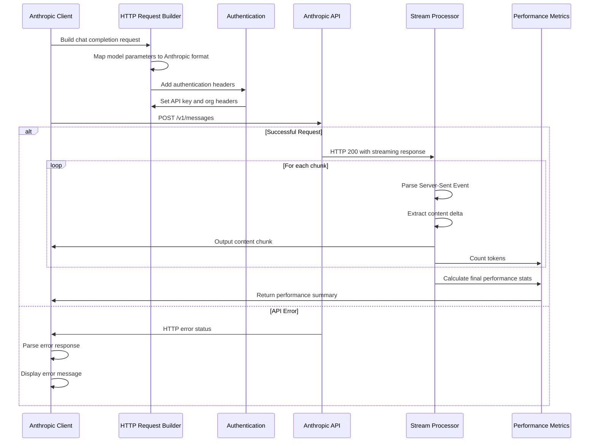

## Context Management System

### Context Window Management

The client implements intelligent context window management:

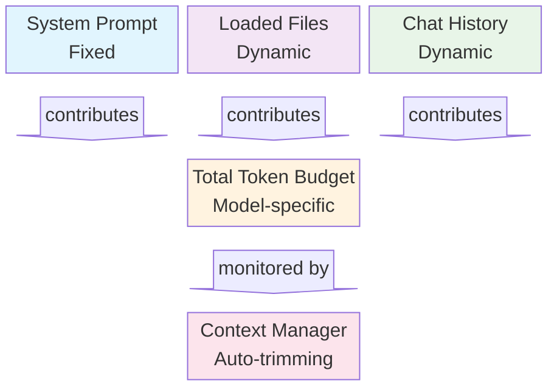

#### Token Counting and Estimation

The client uses a sophisticated token estimation algorithm:

1. **Base Calculation**: ~4 characters per token for English text
2. **Word Length Adjustment**: 
   - Short words (<4 chars): ~3.3 chars per token
   - Long words (>6 chars): ~5 chars per token
   - Medium words: 4 chars per token
3. **Context-Aware**: Different weights for code vs. natural language

#### Context Window Sizing

Model-specific context window detection:

```go
func (c *AnthropicClient) getContextWindow() int {
    switch {
    case strings.HasPrefix(modelName, "claude-3-5-sonnet"):
        return 200000 // Claude 3.5 Sonnet
    case strings.HasPrefix(modelName, "claude-3-5-haiku"):
        return 200000 // Claude 3.5 Haiku
    case strings.HasPrefix(modelName, "claude-3-opus"):
        return 200000 // Claude 3 Opus
    case strings.HasPrefix(modelName, "claude-3-sonnet"):
        return 200000 // Claude 3 Sonnet
    default:
        return 200000 // Conservative default
    }
}
```

### File Context Management

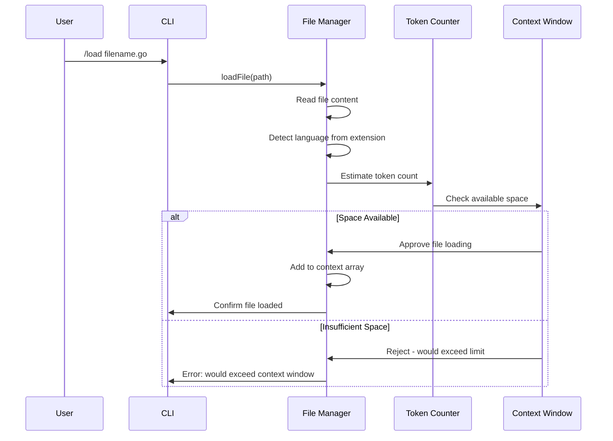

## Configuration System

### Model Configuration Loading

The client supports flexible model configuration through JSON files:

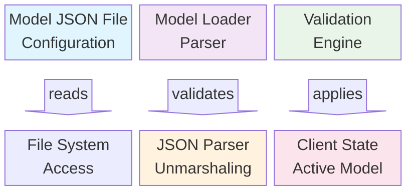

#### Configuration Validation Process

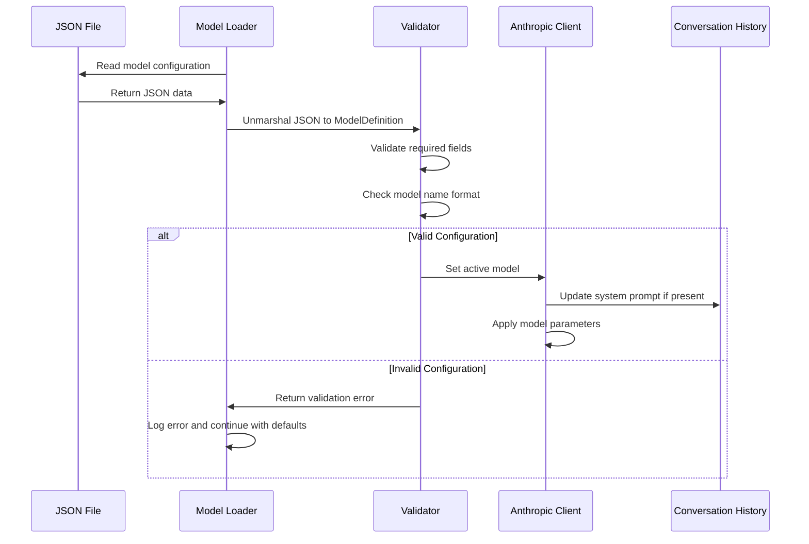

## Performance Monitoring System

### Real-Time Performance Tracking

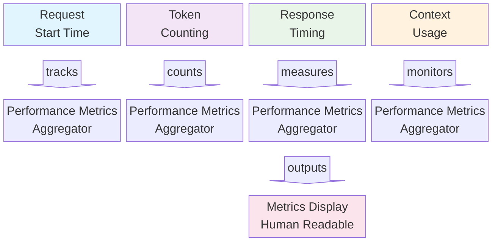

#### Performance Metrics Calculation

The client tracks multiple performance indicators:

1. **Tokens per Second**: `totalTokens / responseTime.Seconds()`
2. **Response Time**: End-to-end request duration
3. **Context Window Usage**: Percentage of available context consumed
4. **Token Distribution**: Breakdown by message type (system, user, assistant, context)

## Command System Architecture

### Command Processing Pipeline

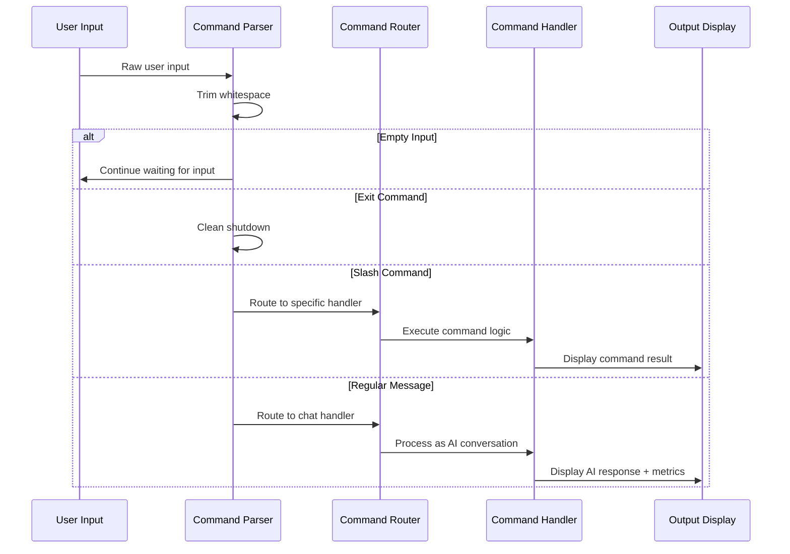

### Available Commands

| Command | Function | Implementation |
|---------|----------|---------------|
| `/help` | Show available commands | `showCommands()` |
| `/load <file>` | Load file into context | `loadFile()` → context management |
| `/model <file>` | Load model configuration | `loadModel()` → model switching |
| `/status` | Show current status | `showStatus()` → comprehensive stats |
| `/history` | Display conversation | History iteration and display |
| `/clear` | Clear conversation | `NewConversationHistory()` reset |
| `/dump` | Export context to file | `dumpContextToFile()` → file export |
| `exit` | Quit application | Clean shutdown |

## Error Handling and Resilience

### Error Handling Strategy

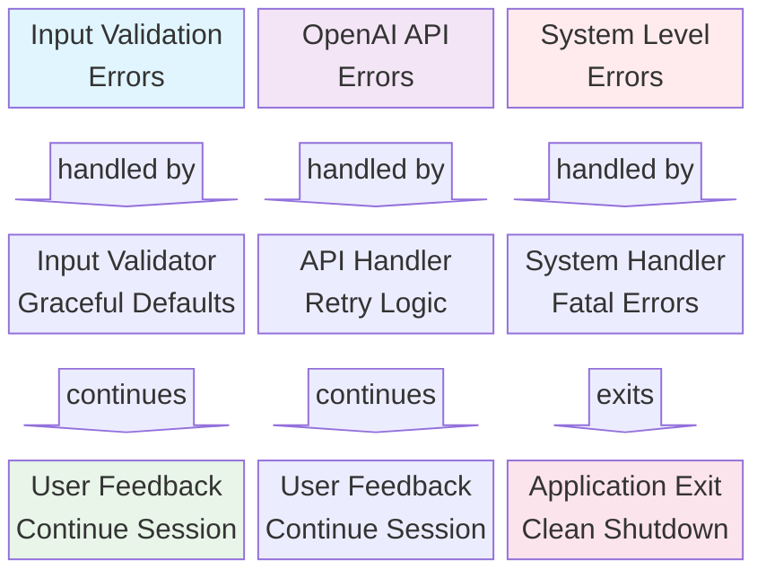

#### Error Categories and Responses

1. **Configuration Errors**:
   - Invalid JSON: Log warning, continue with defaults
   - Missing files: Display error, prompt for retry
   - Invalid parameters: Use fallback values

2. **API Errors**:
   - Authentication failures: Clear error message with setup instructions
   - Rate limiting: Display rate limit information
   - Network errors: Suggest retry with connection details

3. **Context Window Errors**:
   - Oversized context: Automatic trimming with user notification
   - File too large: Rejection with size information
   - Memory constraints: Graceful degradation

## Build and Deployment System

### Build Process Flow

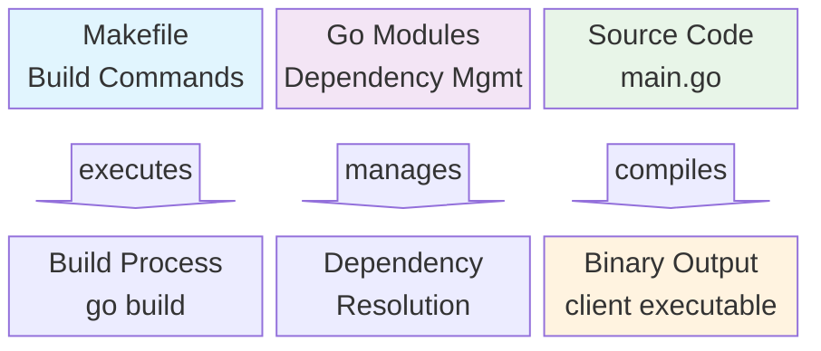

#### Makefile Commands

```bash
build:    # Clean dependencies and build binary
    go mod tidy
    go build -o client ./...

run:      # Build and execute client
    make build && ./client

clean:    # Remove build artifacts
    rm -f client *~ *.log

flush:    # Clean module cache
    go clean -modcache
```

## Dependencies Analysis

### Core Dependencies

Based on `go.mod`, the client uses minimal, focused dependencies:

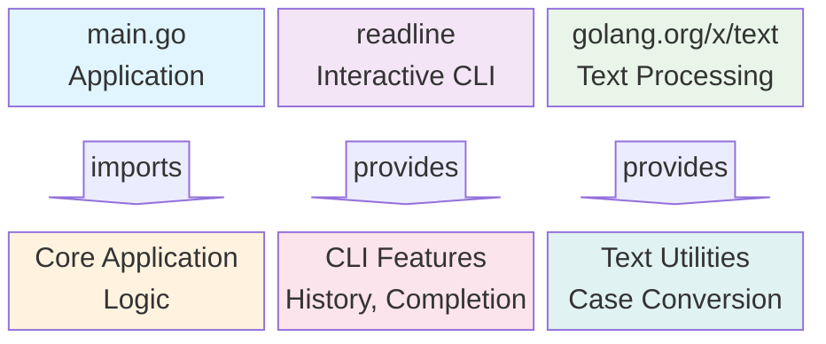

#### Dependency Details

1. **`github.com/chzyer/readline v1.5.1`**:
   - Provides rich CLI functionality
   - Command history persistence
   - Tab completion support
   - Interrupt handling (Ctrl+C, Ctrl+D)

2. **`golang.org/x/text v0.26.0`**:
   - Unicode text processing
   - Language-specific case conversion
   - Used for proper message role capitalization

3. **Standard Library**:
   - `net/http`: OpenAI API communication
   - `encoding/json`: Configuration and API data handling
   - `flag`: Command line argument processing
   - `bufio`: Streaming response processing

## Security Considerations

### Authentication and Authorization

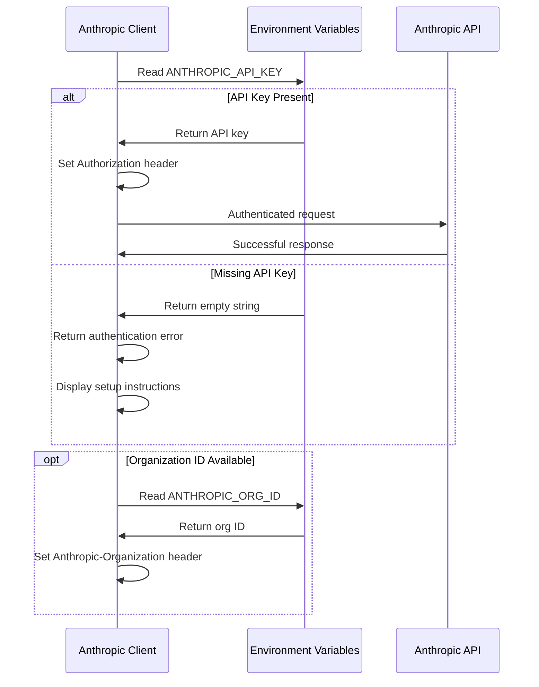

#### Security Best Practices Implemented

1. **Environment Variable Security**:
   - API keys stored in environment variables
   - No hardcoded credentials in source code
   - Optional organization ID support

2. **Input Validation**:
   - File path validation for `/load` commands
   - JSON schema validation for model configurations
   - Command input sanitization

3. **Error Information Disclosure**:
   - API errors logged without exposing sensitive details
   - Generic error messages for user-facing output
   - Detailed errors only in debug contexts

### Data Privacy

1. **Local Data Storage**:
   - Command history stored in temporary directory
   - Context dumps written to local files only
   - No data transmission beyond OpenAI API

2. **Memory Management**:
   - Conversation history automatically trimmed
   - Context files released when not needed
   - No persistent storage of sensitive data

## Performance Optimization

### Token Management Optimization

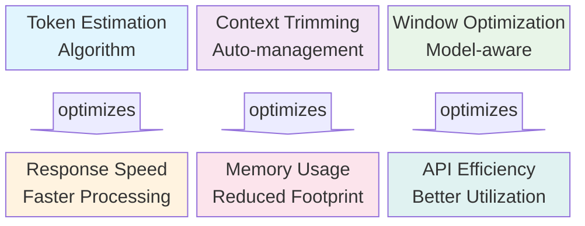

#### Optimization Strategies

1. **Intelligent Token Estimation**:
   - Content-type aware counting (code vs. text)
   - Word-length based adjustments
   - Preemptive context size checking

2. **Automatic Context Management**:
   - Oldest-first message trimming
   - System prompt preservation
   - User/assistant pair maintenance

3. **Streaming Response Processing**:
   - Real-time output display
   - Incremental token counting
   - Minimal memory buffering

## Testing and Quality Assurance

### Current Testing Status

The codebase currently lacks formal testing infrastructure, presenting opportunities for improvement:

#### Recommended Testing Strategy

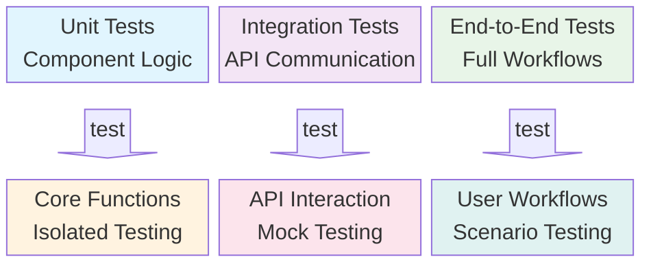

#### Testing Recommendations

1. **Unit Testing Priorities**:
   - Token estimation accuracy
   - Model configuration validation
   - Context window calculations
   - Command parsing logic

2. **Integration Testing Focus**:
   - OpenAI API communication
   - Streaming response handling
   - Authentication flow
   - Error handling scenarios

3. **End-to-End Testing Scenarios**:
   - Complete conversation workflows
   - File loading and context management
   - Model switching operations
   - Performance metrics accuracy

## Extensibility and Future Enhancements

### Architecture Extensibility

The modular design supports several enhancement directions:

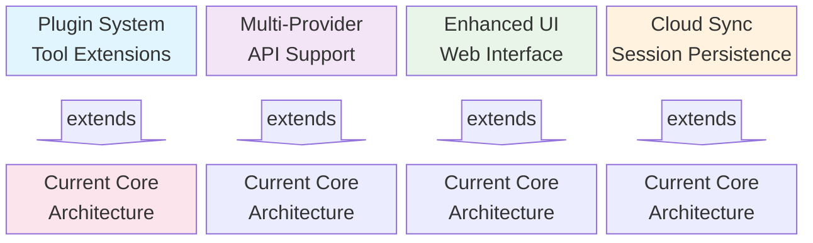

#### Potential Enhancements

1. **Multi-Provider Support**:
   - OpenAI GPT integration
   - Google Gemini support
   - Azure OpenAI Service
   - Local model support (Ollama, etc.)

2. **Advanced Context Management**:
   - Vector embeddings for semantic search
   - Intelligent context summarization
   - Cross-session context persistence
   - Git repository integration

3. **Enhanced User Experience**:
   - Web-based interface option
   - Rich text formatting
   - Syntax highlighting for code
   - Interactive diagrams and charts

4. **Collaboration Features**:
   - Session sharing capabilities
   - Team conversation histories
   - Knowledge base integration
   - Export to documentation formats

## Conclusion

The client represents a well-architected, feature-rich implementation of an Anthropic API client. Its strengths include:

### Key Strengths

1. **Clean Architecture**: Clear separation of concerns with modular design
2. **Intelligent Context Management**: Sophisticated token counting and automatic trimming
3. **Rich Interactive Experience**: Full-featured CLI with command history and completion
4. **Performance Monitoring**: Real-time metrics and context usage tracking
5. **Flexible Configuration**: JSON-based model configuration with validation
6. **Error Resilience**: Graceful error handling with informative user feedback

### Areas for Enhancement

1. **Testing Infrastructure**: Add comprehensive unit, integration, and E2E tests
2. **Security Hardening**: Implement additional input validation and security measures
3. **Multi-Provider Support**: Extend beyond OpenAI to support other AI providers
4. **Advanced Features**: Add vector search, session persistence, and collaboration tools
5. **Documentation**: Expand inline documentation and add developer guides

### Production Readiness

The current implementation is well-suited for:
- **Development and prototyping** environments
- **Individual developer productivity** tools
- **Educational and learning** contexts
- **Research and experimentation** workflows

For enterprise production use, the recommended enhancements would include comprehensive testing, security auditing, monitoring integration, and scalability improvements.

The codebase demonstrates excellent Go programming practices, thoughtful API design, and user-centered functionality, making it an exemplary implementation of a modern CLI application for AI interaction.
