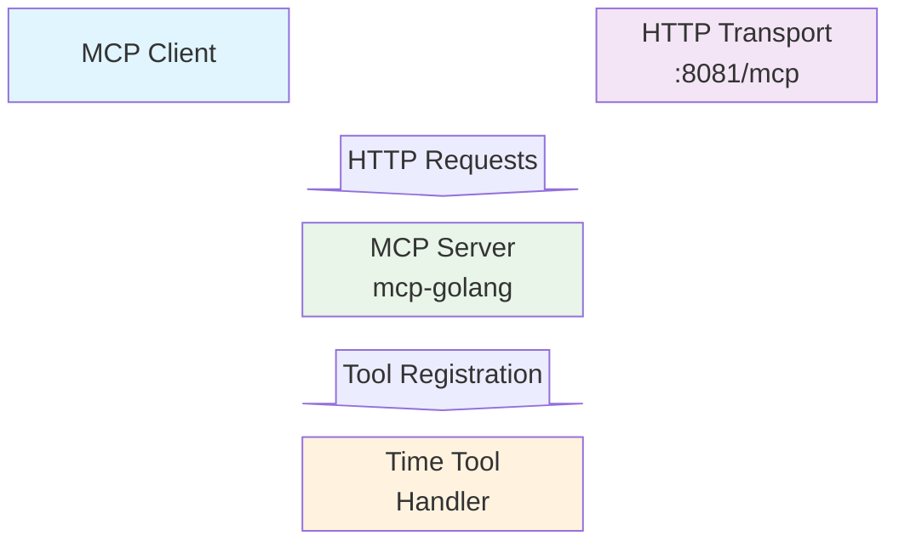
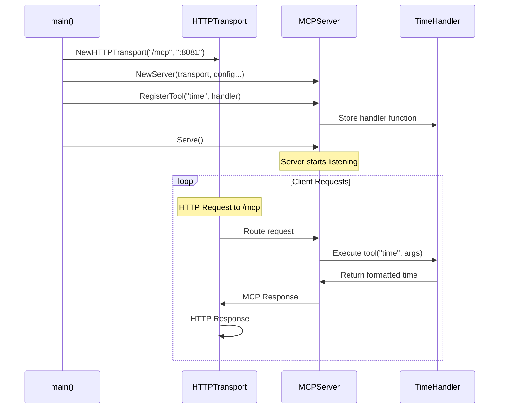
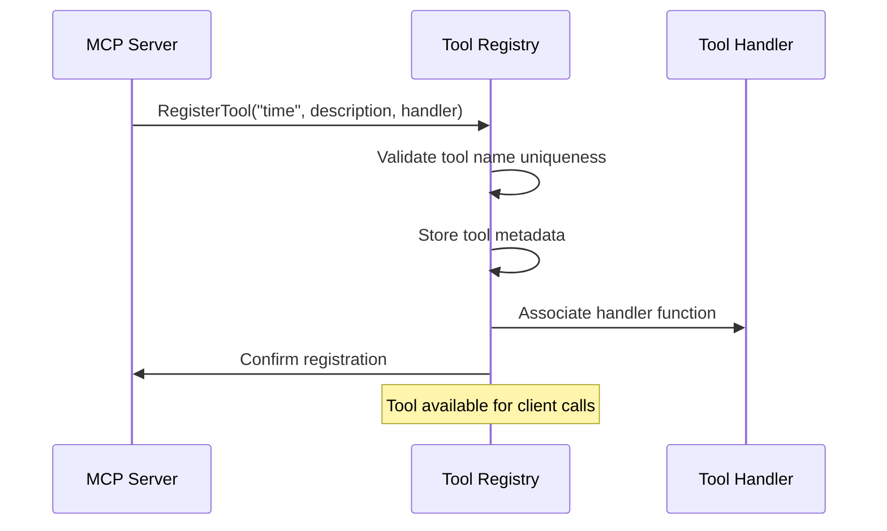
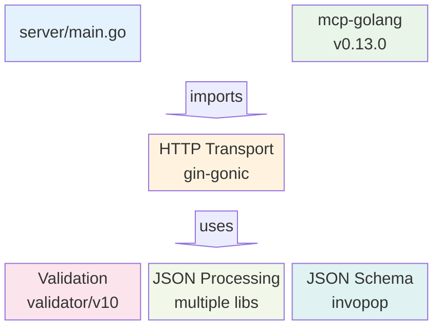
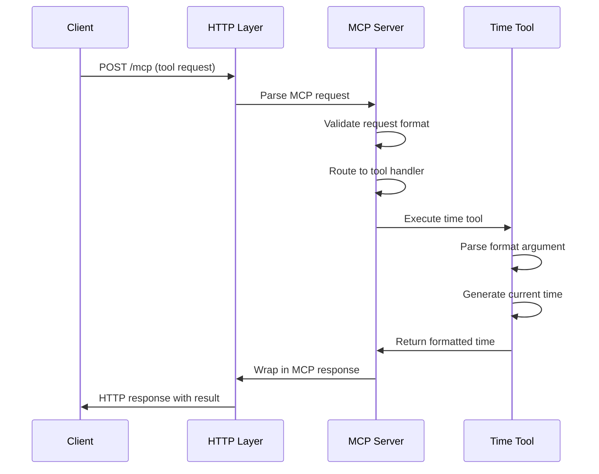
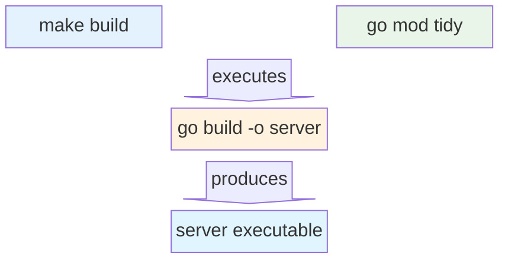

# MCP Server Analysis Report

## Overview

This document provides a comprehensive analysis of the Model Context Protocol (MCP) server implementation found in the `/server` directory. The server is a Go-based HTTP service that implements the MCP specification to provide tools and capabilities to MCP clients.

## Architecture Overview

The server is built using the `github.com/metoro-io/mcp-golang` library and implements a stateless HTTP server that exposes MCP tools through a REST API endpoint.

### System Architecture



### Component Breakdown

#### 1. HTTP Transport Layer
- **Location**: Port 8081, endpoint `/mcp`
- **Purpose**: Handles incoming HTTP requests and routes them to the MCP server
- **Implementation**: Uses the `http.NewHTTPTransport()` from the mcp-golang library

#### 2. MCP Server Core
- **Name**: "mcp-golang-stateless-http-example"
- **Version**: "0.0.1"
- **Description**: "A simple example of a stateless HTTP server using mcp-golang"
- **Purpose**: Manages tool registration and request processing

#### 3. Tool Implementation
- **Current Tools**: Single "time" tool
- **Handler Function**: Returns current time in specified format
- **Input**: Format string parameter
- **Output**: Formatted time string

## Code Analysis

### Main Function Flow



### Data Structures

#### TimeArgs Structure
```go
type TimeArgs struct {
    Format string `json:"format" jsonschema:"description=The time format to use"`
}
```

**Purpose**: Defines the input parameters for the time tool
**Fields**:
- `Format`: String specifying the Go time format layout
- **JSON Schema**: Includes description for API documentation

### Tool Registration Process



## Dependencies Analysis

### Core Dependencies

Based on the `go.mod` file, the server relies on several key libraries:

#### Primary Dependencies
- **`github.com/metoro-io/mcp-golang v0.13.0`**: Core MCP implementation
- **`github.com/gin-gonic/gin v1.8.1`**: HTTP web framework (indirect)

#### Supporting Libraries
- **JSON Processing**: Multiple JSON libraries for request/response handling
  - `github.com/goccy/go-json v0.9.7`
  - `github.com/json-iterator/go v1.1.12`
  - `github.com/buger/jsonparser v1.1.1`

- **Validation**: 
  - `github.com/go-playground/validator/v10 v10.10.0`
  - `github.com/invopop/jsonschema v0.12.0`

- **HTTP Framework Components**:
  - `github.com/gin-contrib/sse v0.1.0` (Server-Sent Events)
  - Various encoding/decoding utilities

### Dependency Graph



## Runtime Behavior

### Server Startup Sequence

1. **Transport Initialization**: Creates HTTP transport on port 8081 with `/mcp` endpoint
2. **Server Creation**: Instantiates MCP server with metadata (name, version, instructions)
3. **Tool Registration**: Registers the "time" tool with its handler function
4. **Service Start**: Begins listening for HTTP requests

### Request Processing Flow



### Error Handling

The server implements basic error handling:
- **Tool Registration Errors**: Panics if tool registration fails
- **Runtime Errors**: Tool handlers can return errors that are propagated to clients
- **HTTP Layer**: Underlying gin framework handles HTTP-level errors

## Configuration

### Server Configuration
- **Name**: "mcp-golang-stateless-http-example"
- **Instructions**: "A simple example of a stateless HTTP server using mcp-golang"
- **Version**: "0.0.1"

### Network Configuration
- **Port**: 8081
- **Endpoint**: `/mcp`
- **Protocol**: HTTP

### Tool Configuration
- **Tool Name**: "time"
- **Description**: "Returns the current time in the specified format"
- **Input Schema**: Accepts format string parameter

## Build System

### Makefile Analysis

```bash
build:          # Builds the server binary
    go mod tidy     # Clean up dependencies
    go build -o server ./...   # Compile to 'server' binary

clean:          # Cleanup build artifacts
    rm -f server    # Remove binary
    rm *~           # Remove backup files
    rm *.log        # Remove log files

run: build      # Build and run server
    ./server

flush:          # Clean module cache
    go clean -modcache
```

### Build Process Flow



## Extensibility and Future Enhancements

### Adding New Tools

The architecture supports easy addition of new tools:

1. **Define Arguments Structure**: Create a struct with JSON tags
2. **Implement Handler Function**: Function that takes args and returns `*mcp_golang.ToolResponse`
3. **Register Tool**: Call `server.RegisterTool()` with name, description, and handler

### Example Extension

```go
type CalculatorArgs struct {
    Operation string  `json:"operation"`
    A         float64 `json:"a"`
    B         float64 `json:"b"`
}

func calculatorHandler(args CalculatorArgs) (*mcp_golang.ToolResponse, error) {
    // Implementation here
}

// Register during server setup
server.RegisterTool("calculator", "Performs basic math operations", calculatorHandler)
```

## Security Considerations

### Current Security Posture
- **No Authentication**: Server accepts requests from any client
- **No Authorization**: All registered tools are accessible to all clients
- **No Input Validation**: Beyond JSON schema validation
- **No Rate Limiting**: Server can be overwhelmed by requests

### Recommended Security Enhancements
1. **Authentication**: Implement API key or token-based auth
2. **Input Sanitization**: Validate and sanitize all tool inputs
3. **Rate Limiting**: Implement request rate limiting
4. **HTTPS**: Use TLS for encrypted communication
5. **Access Control**: Role-based access to different tools

## Performance Characteristics

### Strengths
- **Stateless Design**: Easy to scale horizontally
- **Lightweight**: Minimal memory footprint
- **Fast Startup**: Quick server initialization
- **Concurrent**: Go's goroutine model handles concurrent requests well

### Potential Bottlenecks
- **Single Process**: No built-in clustering
- **Time Tool**: Simple implementation, low latency
- **JSON Processing**: Multiple JSON libraries may add overhead
- **No Caching**: Each request processed independently

## Testing and Validation

### Current Testing Status
- **No Unit Tests**: No test files present in the codebase
- **No Integration Tests**: No automated testing of the HTTP endpoints
- **Manual Testing Required**: Server must be tested manually

### Recommended Testing Strategy
1. **Unit Tests**: Test tool handlers in isolation
2. **Integration Tests**: Test full HTTP request/response cycle
3. **Load Testing**: Verify performance under load
4. **Schema Validation Tests**: Ensure JSON schemas work correctly

## Monitoring and Observability

### Current Monitoring
- **Basic Logging**: Uses Go's standard log package
- **Startup Message**: Logs server start on port 8081
- **No Metrics**: No performance or usage metrics
- **No Health Checks**: No endpoint for health monitoring

### Recommended Monitoring Enhancements
1. **Structured Logging**: Use structured logging library
2. **Metrics**: Add Prometheus metrics for requests, latency, errors
3. **Health Endpoints**: Add `/health` and `/ready` endpoints
4. **Distributed Tracing**: Add OpenTelemetry tracing
5. **Error Tracking**: Implement error tracking and alerting

## Conclusion

The MCP server implementation is a well-structured, minimal example of how to build an MCP-compliant server using Go. The architecture is clean and extensible, making it easy to add new tools and capabilities. However, the current implementation is primarily suitable for development and demonstration purposes.

For production use, significant enhancements would be needed in areas of security, monitoring, testing, and error handling. The stateless design and use of proven libraries (gin, mcp-golang) provide a solid foundation for building a more robust production server.

### Key Strengths
- Clean, readable code structure
- Proper use of MCP library patterns
- Easy tool registration mechanism
- Stateless design for scalability

### Areas for Improvement
- Add comprehensive testing
- Implement security measures
- Add monitoring and observability
- Enhance error handling and validation
- Add configuration management

This server serves as an excellent starting point for understanding MCP server implementation and can be evolved into a production-ready service with the recommended enhancements.
